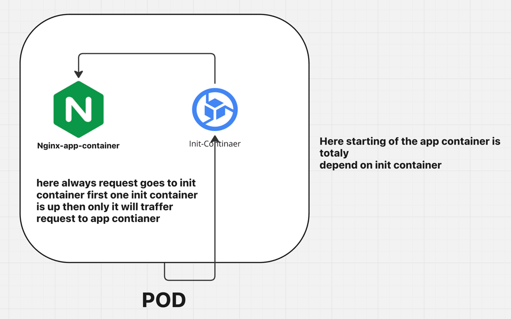

```
a pod is the smallest deployable unit that can contain one or more containers. 
A multi-container pod is simply a pod that holds more than one container. 
These containers are tightly coupled and share the same networking namespace and storage volumes. 
Multi-container pods are used to run closely related application components that need to operate together on the same host, 
such as a main application container and a helper container.
```


**What are Multi-container Pods?**
A multi-container pod contains two or more containers that run on the same node in a Kubernetes cluster. These containers share certain resources like:

1.Networking: All containers in the pod share the same IP address and port space. This means they can communicate with each other over localhost (127.0.0.1), using the same internal network.

2.Storage: Multi-container pods can use the same storage volumes, which makes it easier to share data between containers. This is often used to pass information between containers or store logs and configuration data.

3.The main benefit of multi-container pods is that they allow containers that need to work together to share resources in a way that wouldn't be possible if they were in separate pods.

**Exmaple to describe multicontainer pod**

```commandline
apiVersion: v1
kind: Pod
metadata:
  name: myapp
  labels:
    name: myapp-pod
spec:
  containers:
    - name: myapp-container
      image: busybox:1.28 # here its generic image which maintained by kubernetes which does some specif task
      command: ['sh', '-c', 'echo app is running && sleep 3600'] ## here we can add args and command together also if we want to separate you can look for init containers
      env:
        - name: FIRSTNAME
          value: "Manoj"
## adding multiple containers
  initContainers:
    - name: init-myservice
      image: busybox:1.28
      command: ['sh', '-c']
      args: ['until nslookup myservice.default.svc.cluster.local; do echo "waiting for service to be up" && sleep 2; done'] ## here NSlookup command works only when service working fine and look for service

```
```commandline
12:18:19 manojkrishnappa@Manojs-MacBook-Pro 11-Multicontainer-pod → kubectl apply -f pod.yml 
pod/myapp created
12:18:27 manojkrishnappa@Manojs-MacBook-Pro 11-Multicontainer-pod → kubectl get pods
NAME    READY   STATUS     RESTARTS   AGE
myapp   0/1     Init:0/1   0          3s
12:18:30 manojkrishnappa@Manojs-MacBook-Pro 11-Multicontainer-pod → kubectl get pods
NAME    READY   STATUS     RESTARTS   AGE
myapp   0/1     Init:0/1   0          5s
```
Look for logs 

```commandline
12:18:31 manojkrishnappa@Manojs-MacBook-Pro 11-Multicontainer-pod → kubectl logs -f myapp
Defaulted container "myapp-container" out of: myapp-container, init-myservice (init)
Error from server (BadRequest): container "myapp-container" in pod "myapp" is waiting to start: PodInitializing


Looking for init container pods 
12:19:29 manojkrishnappa@Manojs-MacBook-Pro 11-Multicontainer-pod → kubectl logs -f myapp -c init-myservice
nslookup: can't resolve 'myservice.default.svc.cluster.local'
Server:    10.96.0.10
Address 1: 10.96.0.10 kube-dns.kube-system.svc.cluster.local

waiting for service to be up
Server:    10.96.0.10
Address 1: 10.96.0.10 kube-dns.kube-system.svc.cluster.local

```

Now in order resolve this lets create deployment and service file to initilise the init containers

```commandline
apiVersion: apps/v1
kind: Deployment
metadata:
  name: nginx-deploy
  labels:
    name: myapp-pod
spec:
  replicas: 1
  selector:
    matchLabels:
      name: myapp-pod
  template:
    metadata:
      labels:
        name: myapp-pod
    spec:
      containers:
      - name: nginx
        image: nginx
        ports:
        - containerPort: 80
```

```commandline
12:21:33 manojkrishnappa@Manojs-MacBook-Pro 11-Multicontainer-pod → kubectl apply -f deployment.yml 
deployment.apps/nginx-deploy created

12:28:12 manojkrishnappa@Manojs-MacBook-Pro 11-Multicontainer-pod → kubectl get pods
NAME                           READY   STATUS     RESTARTS   AGE
myapp                          0/1     Init:0/1   0          9m55s
nginx-deploy-5b4fcd577-qzfs2   1/1     Running    0          24s
12:28:21 manojkrishnappa@Manojs-MacBook-Pro 11-Multicontainer-pod → kubectl get pods
NAME                           READY   STATUS     RESTARTS   AGE
myapp                          0/1     Init:0/1   0          9m57s
nginx-deploy-5b4fcd577-qzfs2   1/1     Running    0          26s
```

**CREATING THE SERVICE**
```commandline
apiVersion: v1
kind: Service
metadata:
  name: myservice
spec:
  selector:
    app.kubernetes.io/name: myapp
  ports:
    - protocol: TCP
      port: 80
```
```commandline
12:29:00 manojkrishnappa@Manojs-MacBook-Pro 11-Multicontainer-pod → kubectl apply -f service.yml 
service/myservice created
12:32:57 manojkrishnappa@Manojs-MacBook-Pro 11-Multicontainer-pod → kubectl get pods
NAME                           READY   STATUS     RESTARTS   AGE
myapp                          0/1     Init:0/1   0          14m
nginx-deploy-5b4fcd577-qzfs2   1/1     Running    0          5m3s
12:33:01 manojkrishnappa@Manojs-MacBook-Pro 11-Multicontainer-pod → kubectl get pods
NAME                           READY   STATUS     RESTARTS   AGE
myapp                          0/1     Init:0/1   0          14m
nginx-deploy-5b4fcd577-qzfs2   1/1     Running    0          5m7s

12:33:11 manojkrishnappa@Manojs-MacBook-Pro 11-Multicontainer-pod → kubectl get pods
NAME                           READY   STATUS    RESTARTS   AGE
myapp                          1/1     Running   0          15m
nginx-deploy-5b4fcd577-qzfs2   1/1     Running   0          5m48s

```
Now all the init containers are up and running 

check the the logs of init container below it started resolving the hostname

```commandline
kubectl logs -f myapp -c init-myservice

waiting for service to be up
nslookup: can't resolve 'myservice.default.svc.cluster.local'
Server:    10.96.0.10
Address 1: 10.96.0.10 kube-dns.kube-system.svc.cluster.local

Name:      myservice.default.svc.cluster.local
Address 1: 10.96.96.227 myservice.default.svc.cluster.local
```
**TO PRINT ALL THE ENV VALUES OF THE CONTAINER**

```commandline
12:35:21 manojkrishnappa@Manojs-MacBook-Pro 11-Multicontainer-pod → kubectl exec -it myapp -- printenv
Defaulted container "myapp-container" out of: myapp-container, init-myservice (init)
PATH=/usr/local/sbin:/usr/local/bin:/usr/sbin:/usr/bin:/sbin:/bin
HOSTNAME=myapp
FIRSTNAME=Manoj
MYSERVICE_SERVICE_PORT=80
MYSERVICE_PORT_80_TCP_PROTO=tcp
KUBERNETES_PORT_443_TCP=tcp://10.96.0.1:443
KUBERNETES_PORT_443_TCP_PORT=443
KUBERNETES_PORT_443_TCP_ADDR=10.96.0.1
MYSERVICE_PORT_80_TCP=tcp://10.96.96.227:80
MYSERVICE_PORT_80_TCP_PORT=80
KUBERNETES_PORT=tcp://10.96.0.1:443
KUBERNETES_PORT_443_TCP_PROTO=tcp
MYSERVICE_PORT=tcp://10.96.96.227:80
MYSERVICE_SERVICE_HOST=10.96.96.227
MYSERVICE_PORT_80_TCP_ADDR=10.96.96.227
KUBERNETES_SERVICE_HOST=10.96.0.1
KUBERNETES_SERVICE_PORT=443
KUBERNETES_SERVICE_PORT_HTTPS=443
TERM=xterm
HOME=/root
```

**NOW CREATING THE MULTIPLE INIT CONTAINERS**

```commandline
apiVersion: v1
kind: Pod
metadata:
  name: myapp
  labels:
    name: myapp-pod
spec:
  containers:
    - name: myapp-container
      image: busybox:1.28 # here its generic image which maintained by kubernetes which does some specif task
      command: ['sh', '-c', 'echo app is running && sleep 3600'] ## here we can add args and command together also if we want to separate you can look for init containers
      env:
        - name: FIRSTNAME
          value: "Manoj"
## adding multiple containers
  initContainers:
    - name: init-myservice
      image: busybox:1.28
      command: ['sh', '-c']
      args: ['until nslookup myservice.default.svc.cluster.local; do echo "waiting for service to be up" && sleep 2; done'] ## here NSlookup command works only when service working fine and look for service

    - name: init-mydb
      image: busybox:1.28
      command: ['sh', '-c']
      args: ['until nslookup mydb.default.svc.cluster.local; do echo "waiting for service to be up" && sleep 2; done'] ## here NSlookup command works only when service working fine and look for service
apiVersion: v1
kind: Pod
metadata:
  name: myapp
  labels:
    name: myapp-pod
spec:
  containers:
    - name: myapp-container
      image: busybox:1.28 # here its generic image which maintained by kubernetes which does some specif task
      command: ['sh', '-c', 'echo app is running && sleep 3600'] ## here we can add args and command together also if we want to separate you can look for init containers
      env:
        - name: FIRSTNAME
          value: "Manoj"
## adding multiple containers
  initContainers:
    - name: init-myservice
      image: busybox:1.28
      command: ['sh', '-c']
      args: ['until nslookup myservice.default.svc.cluster.local; do echo "waiting for service to be up" && sleep 2; done'] ## here NSlookup command works only when service working fine and look for service

    - name: init-mydb
      image: busybox:1.28
      command: ['sh', '-c']
      args: ['until nslookup mydb.default.svc.cluster.local; do echo "waiting for service to be up" && sleep 2; done'] ## here NSlookup command works only when service working fine and look for service
```

```commandline
12:42:30 manojkrishnappa@Manojs-MacBook-Pro 11-Multicontainer-pod → kubectl apply -f multiple-init-container.yml
pod/myapp created
12:42:43 manojkrishnappa@Manojs-MacBook-Pro 11-Multicontainer-pod → kubectl get pods
NAME                           READY   STATUS     RESTARTS   AGE
myapp                          0/1     Init:0/2   0          5s
nginx-deploy-5b4fcd577-qzfs2   1/1     Running    0          14m
12:42:48 manojkrishnappa@Manojs-MacBook-Pro 11-Multicontainer-pod → kubectl get pods
NAME                           READY   STATUS     RESTARTS   AGE
myapp                          0/1     Init:1/2   0          22s
nginx-deploy-5b4fcd577-qzfs2   1/1     Running    0          15m

```

Because here we need to add one more service of DB

here we can create in imparative way also 
```commandline
12:44:25 manojkrishnappa@Manojs-MacBook-Pro 11-Multicontainer-pod → kubectl create deploy mydb --image redis --port 80
deployment.apps/mydb created

12:45:20 manojkrishnappa@Manojs-MacBook-Pro 11-Multicontainer-pod → kubectl expose deploy mydb --name mydb --port 80
service/mydb exposed
```
```commandline
12:45:36 manojkrishnappa@Manojs-MacBook-Pro 11-Multicontainer-pod → kubectl get pods
NAME                           READY   STATUS    RESTARTS   AGE
myapp                          1/1     Running   0          3m12s
mydb-5b56d6fb4b-gvf2z          1/1     Running   0          69s
nginx-deploy-5b4fcd577-qzfs2   1/1     Running   0          17m
```

Now all the pods are up and running 