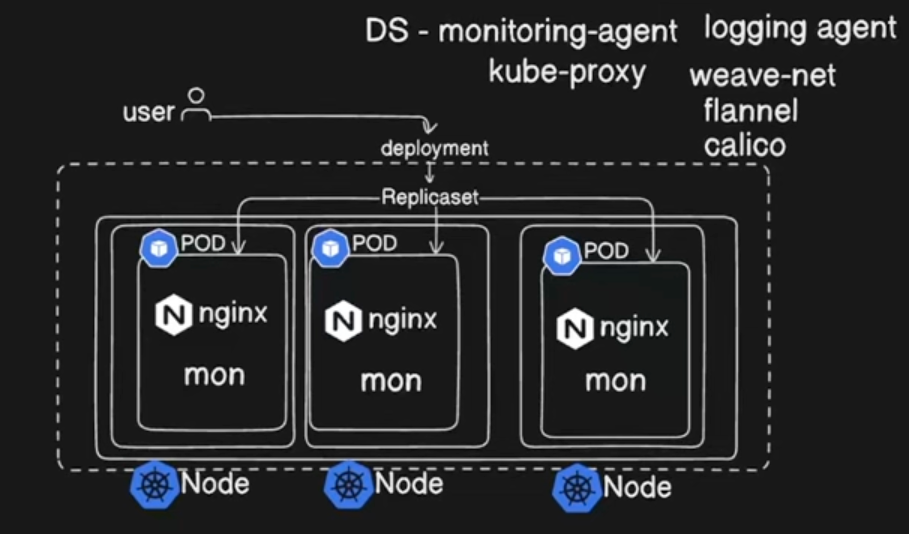

**1. What is demonset..?**
A DaemonSet is a Kubernetes object used to ensure that a copy of a specific pod runs on all (or a subset of) nodes in a cluster. It guarantees that every node in the cluster has a running instance of the specified pod. DaemonSets are typically used for system-level services such as log collection, monitoring, or networking agents, which need to run on each node to operate correctly.

Key Characteristics:
*   Pods created by a DaemonSet run on every node (or a subset of nodes) in the cluster.
*   The DaemonSet controller automatically manages adding or removing pods as nodes are added or removed from the cluster.
*   DaemonSets are often used for tasks like log collection, monitoring, or networking (e.g., a logging agent, metrics exporter, or network proxy).

**2. Why Do We Use DaemonSets in Kubernetes?**

DaemonSets are used when you need to run a pod on every node in your Kubernetes cluster. 

Some common use cases include:

   1.  Logging and monitoring agents: For example, running a Fluentd or Prometheus Node Exporter on every node to collect logs and metrics.
   2.  Networking agents: Running agents such as a Calico or Weave network plugin across all nodes for network-related tasks.
   3.  Node management: Running a custom application or process on every node in the cluster that interacts with hardware, manages logs, or performs a housekeeping task.
   
A DaemonSet automatically manages ensuring that your pod is present on every node and is responsible for scheduling and maintaining the pod across the entire cluster.



**DAEMON SET CREATION**

```commandline
apiVersion: apps/v1
kind: DaemonSet
metadata:
  name: nginx-ds
  labels:
    name: myapp-pod
spec:
## here we dont need replicas as in deployment beacuse irrespective of replica it will automatically create  replica
## it might schedule it on different nodes reason is node tolerations
  selector:
    matchLabels:
      name: myapp-pod
  template:
    metadata:
      labels:
        name: myapp-pod
    spec:
      containers:
      - name: nginx
        image: nginx
        ports:
        - containerPort: 80
```

```commandline
01:04:32 manojkrishnappa@Manojs-MacBook-Pro 12-Demonset-job ±|main ✗|→ kubectl apply -f demonset.yml 
daemonset.apps/nginx-ds created
01:04:48 manojkrishnappa@Manojs-MacBook-Pro 12-Demonset-job ±|main ✗|→ kubectl get ds
NAME       DESIRED   CURRENT   READY   UP-TO-DATE   AVAILABLE   NODE SELECTOR   AGE
nginx-ds   3         3         2       2            2           <none>          6s
```
TO verify in all the nodes as copy check below

```commandline
01:04:54 manojkrishnappa@Manojs-MacBook-Pro 12-Demonset-job ±|main ✗|→ kubectl get ds -n kube-system
NAME         DESIRED   CURRENT   READY   UP-TO-DATE   AVAILABLE   NODE SELECTOR            AGE
kindnet      4         4         4       4            4           kubernetes.io/os=linux   81m
kube-proxy   4         4         4       4            4           kubernetes.io/os=linux   81m
01:05:46 manojkrishnappa@Manojs-MacBook-Pro 12-Demonset-job ±|main ✗|→ kubectl get nodes
NAME                              STATUS   ROLES           AGE   VERSION
manoj-cka-cluster-control-plane   Ready    control-plane   82m   v1.29.10
manoj-cka-cluster-worker          Ready    <none>          81m   v1.29.10
manoj-cka-cluster-worker2         Ready    <none>          81m   v1.29.10
manoj-cka-cluster-worker3         Ready    <none>          81m   v1.29.10
```

**Jobs**
Jobs represent one-off tasks that run to completion and then stop.
A Job creates one or more Pods and will continue to retry execution of the Pods until a specified number of them successfully terminate. 
As pods successfully complete, the Job tracks the successful completions. When a specified number of successful completions is reached, the task (ie, Job) is complete. 
Deleting a Job will clean up the Pods it created.
Suspending a Job will delete its active Pods until the Job is resumed again.

Here is an example Job config. It computes π to 2000 places and prints it out. It takes around 10s to complete.

```commandline
apiVersion: batch/v1
kind: Job
metadata:
  name: pi
spec:
  template:
    spec:
      containers:
      - name: pi
        image: perl:5.34.0
        command: ["perl",  "-Mbignum=bpi", "-wle", "print bpi(2000)"]
      restartPolicy: Never
  backoffLimit: 4
```

**CRONJOB:**
A CronJob starts one-time Jobs on a repeating schedule.
CronJob is meant for performing regular scheduled actions such as backups, report generation, and so on. 
One CronJob object is like one line of a crontab (cron table) file on a Unix system. It runs a Job periodically on a given schedule, written in Cron format.

This example CronJob manifest prints the current time and a hello message every minute:
```commandline
apiVersion: batch/v1
kind: CronJob
metadata:
  name: hello
spec:
  schedule: "* * * * *"
  jobTemplate:
    spec:
      template:
        spec:
          containers:
          - name: hello
            image: busybox:1.28
            imagePullPolicy: IfNotPresent
            command:
            - /bin/sh
            - -c
            - date; echo Hello from the Kubernetes cluster
          restartPolicy: OnFailure
```

