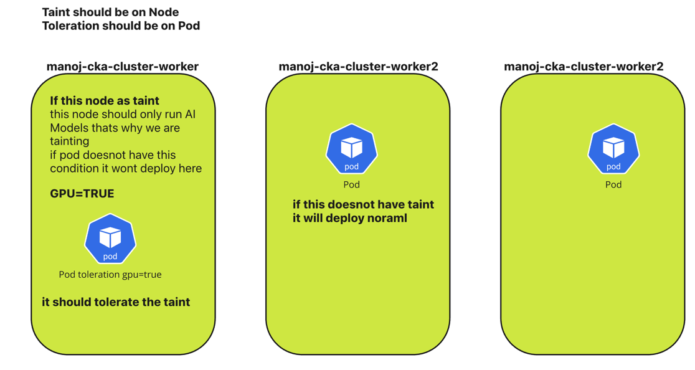
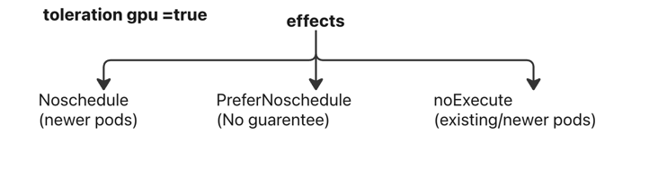

#  Taints and Tolerations in Kubernetes 📘🚀

# Taints and Tolerations in Kubernetes 🚧📜
---

## Taints: Putting Up Fences 🚫

Think of taints as "only you are allowed" signs on your Kubernetes nodes. A taint marks a node with a specific characteristic, such as `"gpu=true"`. By default, pods cannot be scheduled on tainted nodes unless they have a special permission called toleration. When a toleration on a pod matches with the taint on the node then only that pod will be scheduled on that node.

---


## Tolerations: Permission Slips for Pods ✅

Toleration allows a pod to say, "Hey, I can handle that taint. Schedule me anyway!" You define tolerations in the pod specification to let them bypass the taints.

---

## Taints & Tolerations in Action 🎬

Here’s a breakdown of the commands to manage taints and tolerations:

### Tainting a Node:

```bash
03:30:13 manojkrishnappa@Manojs-MacBook-Pro 14-TAINTS AND TOLERATION ±|main ✗|→ kubectl get nodes
NAME                              STATUS   ROLES           AGE     VERSION
manoj-cka-cluster-control-plane   Ready    control-plane   3h47m   v1.29.10
manoj-cka-cluster-worker          Ready    <none>          3h46m   v1.29.10
manoj-cka-cluster-worker2         Ready    <none>          3h46m   v1.29.10
manoj-cka-cluster-worker3         Ready    <none>          3h46m   v1.29.10
03:31:26 manojkrishnappa@Manojs-MacBook-Pro 14-TAINTS AND TOLERATION ±|main ✗|→ kubectl taint node manoj-cka-cluster-worker gpu=true:NoSchedule
node/manoj-cka-cluster-worker tainted
03:31:58 manojkrishnappa@Manojs-MacBook-Pro 14-TAINTS AND TOLERATION ±|main ✗|→ kubectl taint node manoj-cka-cluster-worker2 gpu=true:NoSchedule
node/manoj-cka-cluster-worker2 tainted


verify:

03:32:04 manojkrishnappa@Manojs-MacBook-Pro 14-TAINTS AND TOLERATION ±|main ✗|→ kubectl describe node manoj-cka-cluster-worker2 | grep -i taint
Taints:             gpu=true:NoSchedule

03:33:13 manojkrishnappa@Manojs-MacBook-Pro 14-TAINTS AND TOLERATION ±|main ✗|→ kubectl taint node manoj-cka-cluster-worker3 gpu=true:NoSchedule
node/manoj-cka-cluster-worker3 tainted

```
In the above i have tainted the all the nodes lets deploy the pod to see wether it will tolerate this nodes

```commandline
03:34:09 manojkrishnappa@Manojs-MacBook-Pro 14-TAINTS AND TOLERATION ±|main ✗|→ kubectl run nginx --image=nginx
pod/nginx created
03:35:40 manojkrishnappa@Manojs-MacBook-Pro 14-TAINTS AND TOLERATION ±|main ✗|→ kubectl get pods
NAME    READY   STATUS    RESTARTS   AGE
nginx   0/1     Pending   0          7s

03:35:47 manojkrishnappa@Manojs-MacBook-Pro 14-TAINTS AND TOLERATION ±|main ✗|→ kubectl describe pod nginx
Name:             nginx
Namespace:        default
Priority:         0
Service Account:  default
Node:             <none>
Labels:           run=nginx
Annotations:      <none>
Status:           Pending
IP:               
IPs:              <none>
Containers:
  nginx:
    Image:        nginx
    Port:         <none>
    Host Port:    <none>
    Environment:  <none>
    Mounts:
      /var/run/secrets/kubernetes.io/serviceaccount from kube-api-access-8h6kh (ro)
Conditions:
  Type           Status
  PodScheduled   False 
Volumes:
  kube-api-access-8h6kh:
    Type:                    Projected (a volume that contains injected data from multiple sources)
    TokenExpirationSeconds:  3607
    ConfigMapName:           kube-root-ca.crt
    ConfigMapOptional:       <nil>
    DownwardAPI:             true
QoS Class:                   BestEffort
Node-Selectors:              <none>
Tolerations:                 node.kubernetes.io/not-ready:NoExecute op=Exists for 300s
                             node.kubernetes.io/unreachable:NoExecute op=Exists for 300s
Events:
  Type     Reason            Age   From               Message
  ----     ------            ----  ----               -------
  Warning  FailedScheduling  27s   default-scheduler  0/4 nodes are available: 1 node(s) had untolerated taint {node-role.kubernetes.io/control-plane: }, 3 node(s) had untolerated taint {gpu: true}. preemption: 0/4 nodes are available: 4 Preemption is not helpful for scheduling.

```
So here its failed to schedule because it doesnot have gpu=true


This command taints node1 with the key "gpu" and the effect "NoSchedule." Pods without a toleration for this taint won't be scheduled there.

To remove the taint , you add - at the end of the command , like below.

Also we cannot add toleration in imperative way

### Adding toleration to the pod:

```yaml
apiVersion: v1
kind: Pod
metadata:
  labels:
    run: redis
  name: redis
spec:
  containers:
  - image: redis
    name: redis
  tolerations:
  - key: "gpu"
    operator: "Equal"
    value: "true"
    effect: "NoSchedule"
```
```commandline
03:38:26 manojkrishnappa@Manojs-MacBook-Pro 14-TAINTS AND TOLERATION ±|main ✗|→ kubectl apply -f pod.yml 
pod/redis created
03:38:33 manojkrishnappa@Manojs-MacBook-Pro 14-TAINTS AND TOLERATION ±|main ✗|→ kubectl get pods
NAME    READY   STATUS              RESTARTS   AGE
nginx   0/1     Pending             0          2m59s
redis   0/1     ContainerCreating   0          6s
03:38:44 manojkrishnappa@Manojs-MacBook-Pro 14-TAINTS AND TOLERATION ±|main ✗|→ kubectl get pods
NAME    READY   STATUS    RESTARTS   AGE
nginx   0/1     Pending   0          3m30s
redis   1/1     Running   0          37s

```
**REMOVING THE TAINTS ON THE NODES**
```commandline
03:41:41 manojkrishnappa@Manojs-MacBook-Pro 14-TAINTS AND TOLERATION ±|main ✗|→ kubectl get nodes
NAME                              STATUS   ROLES           AGE     VERSION
manoj-cka-cluster-control-plane   Ready    control-plane   3h57m   v1.29.10
manoj-cka-cluster-worker          Ready    <none>          3h57m   v1.29.10
manoj-cka-cluster-worker2         Ready    <none>          3h57m   v1.29.10
manoj-cka-cluster-worker3         Ready    <none>          3h57m   v1.29.10
03:41:49 manojkrishnappa@Manojs-MacBook-Pro 14-TAINTS AND TOLERATION ±|main ✗|→ kubectl describe node manoj-cka-cluster-worker | grep Taints
Taints:             gpu=true:NoSchedule
03:42:02 manojkrishnappa@Manojs-MacBook-Pro 14-TAINTS AND TOLERATION ±|main ✗|→ kubectl taint node manoj-cka-cluster-worker gpu=true:NoSchedule-
node/manoj-cka-cluster-worker untainted
03:42:55 manojkrishnappa@Manojs-MacBook-Pro 14-TAINTS AND TOLERATION ±|main ✗|→ kubectl taint node manoj-cka-cluster-worker2 gpu=true:NoSchedule-
node/manoj-cka-cluster-worker2 untainted
03:43:09 manojkrishnappa@Manojs-MacBook-Pro 14-TAINTS AND TOLERATION ±|main ✗|→ kubectl taint node manoj-cka-cluster-worker3 gpu=true:NoSchedule-
node/manoj-cka-cluster-worker3 untainted
```


>Note: This pod specification defines a toleration for the "gpu" taint with the effect "NoSchedule." This allows the pod to be scheduled on tainted nodes.
>Note: Contol plane as always in the taint thats why it should avoid that
### Labels vs Taints/Tolerations

Labels group nodes based on size, type,env, etc. Unlike taints, labels don't directly affect scheduling but are useful for organizing resources.

### Limitations to Remember 🚧

Taints and tolerations are powerful tools, but they have limitations. They cannot handle complex expressions like "AND" or "OR." 
So, what do we use in that case? We use a combination of Taints, tolerance, and Node affinity, which we will discuss in the next video.


## NodeSelectors:
The way selctors works 
Before that taints and toleration prevent one node to taint but what if we have without taint
it will schedule on that node it doesnot guarenty where it will go n sit 

It only restrict the pod scheduleing on that perticular node so we need to one function to it

Inseted of node making descion we are giving pod decide node

lets create a yaml with nodeselector


```yaml
apiVersion: v1
kind: Pod
metadata:
  labels:
    run: redis
  name: redis
spec:
  containers:
  - image: redis
    name: redis
  nodeSelector:
    gpu: "false"  # Only schedule on nodes with gpu=false label

```
```commandline
09:38:46 manojkrishnappa@Manojs-MacBook-Pro 14-TAINTS AND TOLERATION ±|main ✗|→ ls
TAINTSANDTOLERATION.MD  img.png                 img_1.png               nodeselector.yml        pod.yml
09:38:48 manojkrishnappa@Manojs-MacBook-Pro 14-TAINTS AND TOLERATION ±|main ✗|→ kubectl apply -f nodeselector.yml 
pod/redis created
09:38:54 manojkrishnappa@Manojs-MacBook-Pro 14-TAINTS AND TOLERATION ±|main ✗|→ kubectl get pods
NAME    READY   STATUS    RESTARTS   AGE
redis   0/1     Pending   0          5s

```

```commandline
kubectl describe pod redis
Name:             redis
Namespace:        default
Priority:         0
Service Account:  default
Node:             <none>
Labels:           run=redis
Annotations:      <none>
Status:           Pending
IP:               
IPs:              <none>
Containers:
  redis:
    Image:        redis
    Port:         <none>
    Host Port:    <none>
    Environment:  <none>
    Mounts:
      /var/run/secrets/kubernetes.io/serviceaccount from kube-api-access-qvgwb (ro)
Conditions:
  Type           Status
  PodScheduled   False 
Volumes:
  kube-api-access-qvgwb:
    Type:                    Projected (a volume that contains injected data from multiple sources)
    TokenExpirationSeconds:  3607
    ConfigMapName:           kube-root-ca.crt
    ConfigMapOptional:       <nil>
    DownwardAPI:             true
QoS Class:                   BestEffort
Node-Selectors:              gpu=false
Tolerations:                 node.kubernetes.io/not-ready:NoExecute op=Exists for 300s
                             node.kubernetes.io/unreachable:NoExecute op=Exists for 300s
Events:
  Type     Reason            Age   From               Message
  ----     ------            ----  ----               -------
  Warning  FailedScheduling  24s   default-scheduler  0/4 nodes are available: 1 node(s) didn't match Pod's node affinity/selector, 1 node(s) had untolerated taint {node-role.kubernetes.io/control-plane: }, 2 node(s) had untolerated taint {gpu: true}. preemption: 0/4 nodes are available: 4 Preemption is not helpful for scheduling.

```
lets match the labels with 

```commandline
09:40:54 manojkrishnappa@Manojs-MacBook-Pro 14-TAINTS AND TOLERATION ±|main ✗|→ kubectl label node manoj-cka-cluster-worker3 gpu=false
node/manoj-cka-cluster-worker3 labeled
09:41:14 manojkrishnappa@Manojs-MacBook-Pro 14-TAINTS AND TOLERATION ±|main ✗|→ kubectl get pods
NAME    READY   STATUS    RESTARTS   AGE
redis   0/1     Pending   0          2m25s

```


```commandline
kubectl get nodes --show-labels
manoj-cka-cluster-worker3         Ready    <none>          20d   v1.31.2   beta.kubernetes.io/arch=arm64,beta.kubernetes.io/os=linux,gpu=false,kubernetes.io/arch=arm64,kubernetes.io/hostname=manoj-cka-cluster-worker3,kubernetes.io/os=linux

```