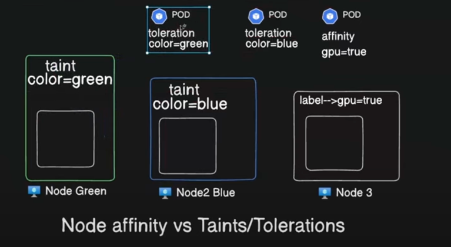
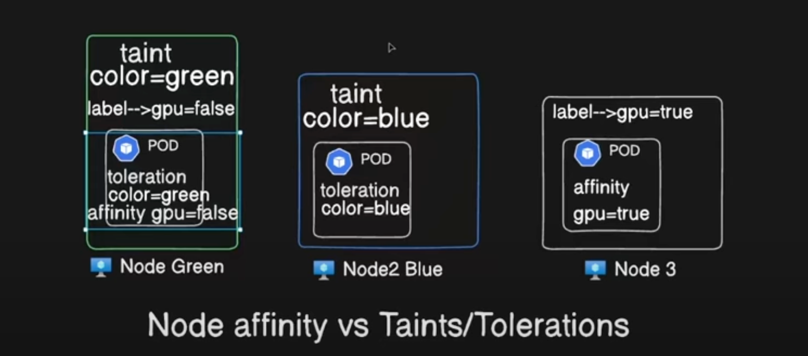

# Kubernetes node affinity
## Beyond Node Selectors: Introducing Affinity 🚀

Node Selectors are great for basic pod placement based on node labels. But what if you need more control over where your pods land? Enter **Node Affinity**! This feature offers advanced capabilities to fine-tune pod scheduling in your Kubernetes cluster.

---
## Node Affinity: The Powerhouse 🔥

Node Affinity lets you define complex rules for where your pods can be scheduled based on node labels. Think of it as creating a wishlist for your pod's ideal home!

### Key Features:
- **Flexibility**: Define precise conditions for pod placement.
- **Control**: Decide where your pods can and cannot go with greater granularity.
- **Adaptability**: Allow pods to stay on their nodes even if the labels change after scheduling.

---

## Properties in Node Affinity
- requiredDuringSchedulingIgnoredDuringExecution
- preferredDuringSchedulingIgnoredDuringExecution

## Required During Scheduling, Ignored During Execution 🛠️

This is the strictest type of Node Affinity. Here's how it works:

1. **Specify Node Labels**: Define a list of required node labels (e.g., `disktype=ssd`) in your pod spec.
2. **Exact Match Requirement**: The scheduler only places the pod on nodes with those exact labels.
3. **Execution Consistency**: Once scheduled, the pod remains on the node even if the label changes.

## Schedule a Pod using required node affinity

```commandline
apiVersion: v1
kind: Pod
metadata:
  name: nginx
spec:
  affinity:
    nodeAffinity:
      requiredDuringSchedulingIgnoredDuringExecution:
        nodeSelectorTerms:
        - matchExpressions:
          - key: disktype
            operator: In
            values:
            - ssd
  containers:
  - name: nginx
    image: nginx
    imagePullPolicy: IfNotPresent
```

It doesnot have any matching value ssd
```commandline
06:33:51 manojkrishnappa@Manojs-MacBook-Pro 15-NODE-AFFINITY ±|main ✗|→ kubectl get nodes --show-labels
NAME                              STATUS   ROLES           AGE     VERSION    LABELS
manoj-cka-cluster-control-plane   Ready    control-plane   6h49m   v1.29.10   beta.kubernetes.io/arch=arm64,beta.kubernetes.io/os=linux,kubernetes.io/arch=arm64,kubernetes.io/hostname=manoj-cka-cluster-control-plane,kubernetes.io/os=linux,node-role.kubernetes.io/control-plane=,node.kubernetes.io/exclude-from-external-load-balancers=
manoj-cka-cluster-worker          Ready    <none>          6h49m   v1.29.10   beta.kubernetes.io/arch=arm64,beta.kubernetes.io/os=linux,kubernetes.io/arch=arm64,kubernetes.io/hostname=manoj-cka-cluster-worker,kubernetes.io/os=linux
manoj-cka-cluster-worker2         Ready    <none>          6h49m   v1.29.10   beta.kubernetes.io/arch=arm64,beta.kubernetes.io/os=linux,kubernetes.io/arch=arm64,kubernetes.io/hostname=manoj-cka-cluster-worker2,kubernetes.io/os=linux
manoj-cka-cluster-worker3         Ready    <none>          6h49m   v1.29.10   beta.kubernetes.io/arch=arm64,beta.kubernetes.io/os=linux,kubernetes.io/arch=arm64,kubernetes.io/hostname=manoj-cka-cluster-worker3,kubernetes.io/os=linux


06:41:28 manojkrishnappa@Manojs-MacBook-Pro 15-NODE-AFFINITY ±|main ✗|→ kubectl apply -f affinity.yml 
pod/nginx created
06:41:43 manojkrishnappa@Manojs-MacBook-Pro 15-NODE-AFFINITY ±|main ✗|→ kubectl get pods
NAME    READY   STATUS    RESTARTS   AGE
nginx   0/1     Pending   0          4s

06:41:47 manojkrishnappa@Manojs-MacBook-Pro 15-NODE-AFFINITY ±|main ✗|→ kubectl describe pod nginx
Name:             nginx
Namespace:        default
Priority:         0
Service Account:  default
Node:             <none>
Labels:           <none>
Annotations:      <none>
Status:           Pending
IP:               
IPs:              <none>
Containers:
  nginx:
    Image:        nginx
    Port:         <none>
    Host Port:    <none>
    Environment:  <none>
    Mounts:
      /var/run/secrets/kubernetes.io/serviceaccount from kube-api-access-9mxs5 (ro)
Conditions:
  Type           Status
  PodScheduled   False 
Volumes:
  kube-api-access-9mxs5:
    Type:                    Projected (a volume that contains injected data from multiple sources)
    TokenExpirationSeconds:  3607
    ConfigMapName:           kube-root-ca.crt
    ConfigMapOptional:       <nil>
    DownwardAPI:             true
QoS Class:                   BestEffort
Node-Selectors:              <none>
Tolerations:                 node.kubernetes.io/not-ready:NoExecute op=Exists for 300s
                             node.kubernetes.io/unreachable:NoExecute op=Exists for 300s
Events:
  Type     Reason            Age   From               Message
  ----     ------            ----  ----               -------
  Warning  FailedScheduling  31s   default-scheduler  0/4 nodes are available: 1 node(s) had untolerated taint {node-role.kubernetes.io/control-plane: }, 3 node(s) didn't match Pod's node affinity/selector. preemption: 0/4 nodes are available: 4 Preemption is not helpful for scheduling.

```
ERROR:
```commandline
3 node(s) didn't match Pod's node affinity/selector. preemption: 0/4 nodes are available: 4 Preemption is not helpful for scheduling.
```

**ADD LABELS TO NODE** 
```commandline
06:44:14 manojkrishnappa@Manojs-MacBook-Pro 15-NODE-AFFINITY ±|main ✗|→ kubectl label node manoj-cka-cluster-worker disktype=ssd
node/manoj-cka-cluster-worker labeled
06:44:39 manojkrishnappa@Manojs-MacBook-Pro 15-NODE-AFFINITY ±|main ✗|→ kubectl get pods
NAME    READY   STATUS    RESTARTS   AGE
nginx   1/1     Running   0          3m2s
```


## Schedule a Pod using preferred node affinity 
**This manifest describes a Pod that has a preferredDuringSchedulingIgnoredDuringExecution node affinity,disktype: ssd. This means that the pod will prefer a node that has a disktype=ssd label.**

```commandline

apiVersion: v1
kind: Pod
metadata:
  name: nginx
spec:
  affinity:
    nodeAffinity:
      preferredDuringSchedulingIgnoredDuringExecution:
      - weight: 1
        preference:
          matchExpressions:
          - key: disktype
            operator: In
            values:
            - hdd          
  containers:
  - name: nginx
    image: nginx
    imagePullPolicy: IfNotPresent
```

```commandline
06:50:34 manojkrishnappa@Manojs-MacBook-Pro 15-NODE-AFFINITY ±|main ✗|→ kubectl apply -f affinity.yml 
pod/nginx created
06:50:38 manojkrishnappa@Manojs-MacBook-Pro 15-NODE-AFFINITY ±|main ✗|→ kubectl get pods --output=wide
NAME    READY   STATUS    RESTARTS   AGE   IP            NODE                       NOMINATED NODE   READINESS GATES
nginx   1/1     Running   0          3s    10.244.1.11   manoj-cka-cluster-worker   <none>           <none>

```

Even though we dont have HDD value still it assign 
```commandline
06:51:29 manojkrishnappa@Manojs-MacBook-Pro 15-NODE-AFFINITY ±|main ✗|→ kubectl get nodes --show-labels
NAME                              STATUS   ROLES           AGE    VERSION    LABELS
manoj-cka-cluster-control-plane   Ready    control-plane   7h7m   v1.29.10   beta.kubernetes.io/arch=arm64,beta.kubernetes.io/os=linux,kubernetes.io/arch=arm64,kubernetes.io/hostname=manoj-cka-cluster-control-plane,kubernetes.io/os=linux,node-role.kubernetes.io/control-plane=,node.kubernetes.io/exclude-from-external-load-balancers=
manoj-cka-cluster-worker          Ready    <none>          7h7m   v1.29.10   beta.kubernetes.io/arch=arm64,beta.kubernetes.io/os=linux,disktype=ssd,kubernetes.io/arch=arm64,kubernetes.io/hostname=manoj-cka-cluster-worker,kubernetes.io/os=linux

```




