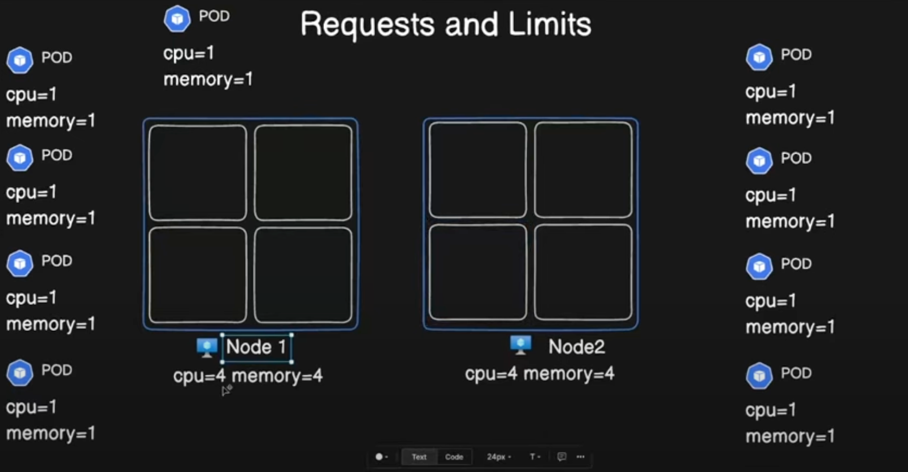

# Kubernetes Requests and Limits
# Understanding Kubernetes Requests & Limits 🚀🔧

Welcome to the Kubernetes Requests & Limits guide! This document complements our video explaining managing resource allocation in your Kubernetes cluster. Let’s explore the essentials of Requests and Limits, why they matter, and how to use them effectively.




---

## 🏙️ What's the Deal with Requests & Limits?

Think of your Kubernetes cluster as a bustling city and pods as tenants in an apartment building. Each tenant (pod) requires specific resources like CPU and memory to function:

- **Requests**: This is the minimum amount of resources a pod needs to operate smoothly. Think of it as a guaranteed reservation for the pod.
- **Limits**: This is the maximum amount of resources a pod can use. It acts as a safety cap to prevent any pod from consuming more than its fair share and disrupting others.

---

## 🧐 Why are Requests & Limits Important?

- **Resource Control**: By setting limits, you prevent a single pod from monopolizing resources, which can lead to issues like out-of-memory (OOM) kills or CPU starvation. ☠️ Why OOM can be a good thing? Because it kills the pod; otherwise, the container would have consumed all the memory and could kill the node. Killing the pod is a better option than killing a node itself.
- **Predictability**: Requests help the scheduler allocate resources efficiently and ensure pods have the necessary resources to run effectively.

---

## 🔍 Exploring Resource Management in Action

In our video, we demonstrated some practical examples using YAML files and Kubernetes commands:

1. **Utilising Available Memory**:
   - A pod requesting  memory  is available will be active
  
```yaml
apiVersion: v1
kind: Pod
metadata:
  name: memory-demo-1
  namespace: mem-testing 
spec:
  containers:
  - name: memory-demo-2-ctr
    image: polinux/stress
    resources:
      requests:
        memory: "250Mi"
      limits:
        memory: "250Mi"
    command: ["stress"]
    args: ["--vm", "1", "--vm-bytes", "150M", "--vm-hang", "1"]
```
```commandline
07:59:55 manojkrishnappa@Manojs-MacBook-Pro 16-REQUESTS AND LIMITS ±|main ✗|→ kubectl apply -f test1.yml 
pod/memory-demo-1 created
08:00:07 manojkrishnappa@Manojs-MacBook-Pro 16-REQUESTS AND LIMITS ±|main ✗|→ kubectl get pods -n mem-testing
NAME            READY   STATUS              RESTARTS   AGE
memory-demo-1   0/1     ContainerCreating   0          3s
08:00:10 manojkrishnappa@Manojs-MacBook-Pro 16-REQUESTS AND LIMITS ±|main ✗|→ kubectl get pods -n mem-testing
NAME            READY   STATUS    RESTARTS   AGE
memory-demo-1   1/1     Running   0          4s


checking memory:
08:00:38 manojkrishnappa@Manojs-MacBook-Pro 16-REQUESTS AND LIMITS ±|main ✗|→ kubectl top pods -n mem-testing
NAME            CPU(cores)   MEMORY(bytes)   
memory-demo-1   63m          151Mi   
```

2**Exceeding Available Memory**:
   - A pod requesting more memory than is available will be killed due to an OOM (Out of Memory) error.

```yaml
apiVersion: v1
kind: Pod
metadata:
  name: memory-demo-2
  namespace: mem-example
spec:
  containers:
  - name: memory-demo-2-ctr
    image: polinux/stress
    resources:
      requests:
        memory: "50Mi"
      limits:
        memory: "100Mi"
    command: ["stress"]
    args: ["--vm", "1", "--vm-bytes", "250M", "--vm-hang", "1"]
```
**COMMANDS**
```commandline
08:00:41 manojkrishnappa@Manojs-MacBook-Pro 16-REQUESTS AND LIMITS ±|main ✗|→ kubectl apply -f test2.yml 
pod/memory-demo-2 created

08:04:27 manojkrishnappa@Manojs-MacBook-Pro 16-REQUESTS AND LIMITS ±|main ✗|→ kubectl get pods -n mem-testing
NAME            READY   STATUS             RESTARTS      AGE
memory-demo-1   1/1     Running            0             4m27s
memory-demo-2   0/1     CrashLoopBackOff   3 (47s ago)   107s

```


3 The Below pod execding node memory

```yaml
apiVersion: v1
kind: Pod
metadata:
  name: memory-demo
  namespace: mem-example
spec:
  containers:
  - name: memory-demo-ctr
    image: polinux/stress
    resources:
      requests:
        memory: "1G"
      limits:
        memory: "2G"
    command: ["stress"]
    args: ["--vm", "1", "--vm-bytes", "150M", "--vm-hang", "1"]
```

**COMMANDS**
```commandline
08:04:52 manojkrishnappa@Manojs-MacBook-Pro 16-REQUESTS AND LIMITS ±|main ✗|→ kubectl apply -f test3.yml 
pod/memory-demo-3 created

08:06:35 manojkrishnappa@Manojs-MacBook-Pro 16-REQUESTS AND LIMITS ±|main ✗|→ kubectl get pods -n mem-testing
NAME            READY   STATUS              RESTARTS      AGE
memory-demo-1   1/1     Running             0             6m30s
memory-demo-2   0/1     CrashLoopBackOff    5 (28s ago)   3m50s
memory-demo-3   0/1     ContainerCreating   0             5s
08:06:37 manojkrishnappa@Manojs-MacBook-Pro 16-REQUESTS AND LIMITS ±|main ✗|→ kubectl top pods -n mem-testing
NAME            CPU(cores)   MEMORY(bytes)   
memory-demo-1   60m          151Mi           
memory-demo-3   61m          151Mi   
```

## COMMANDS

```commandline
kubectl apply -f server-metrics.yml 
serviceaccount/metrics-server created
clusterrole.rbac.authorization.k8s.io/system:aggregated-metrics-reader created
clusterrole.rbac.authorization.k8s.io/system:metrics-server created
rolebinding.rbac.authorization.k8s.io/metrics-server-auth-reader created
clusterrolebinding.rbac.authorization.k8s.io/metrics-server:system:auth-delegator created
clusterrolebinding.rbac.authorization.k8s.io/system:metrics-server created
service/metrics-server created
deployment.apps/metrics-server created
apiservice.apiregistration.k8s.io/v1beta1.metrics.k8s.io created
```

```commandline
07:53:05 manojkrishnappa@Manojs-MacBook-Pro 16-REQUESTS AND LIMITS ±|main ✗|→ kubectl top nodes
NAME                              CPU(cores)   CPU%   MEMORY(bytes)   MEMORY%   
manoj-cka-cluster-control-plane   180m         4%     693Mi           34%       
manoj-cka-cluster-worker          27m          0%     179Mi           9%        
manoj-cka-cluster-worker2         35m          0%     200Mi           10%       
manoj-cka-cluster-worker3         24m          0%     158Mi           7%   

```

