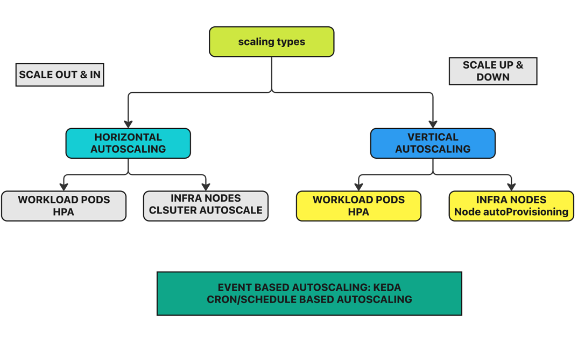
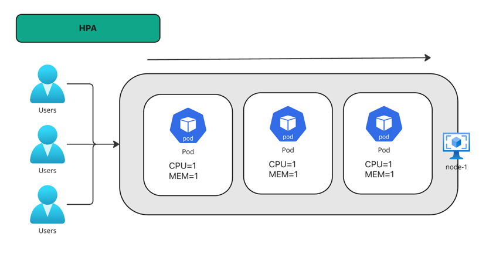
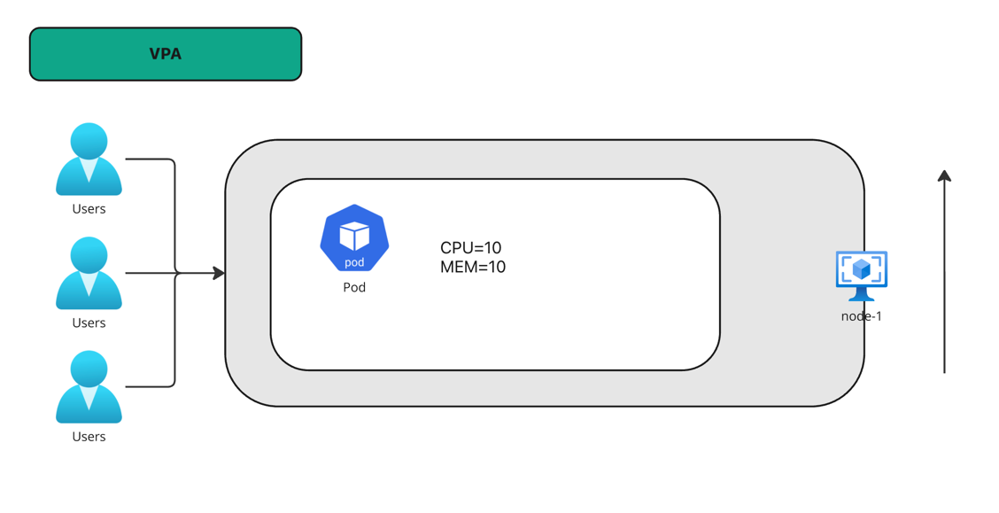

# Kubernetes Autoscaling | HPA Vs VPA

## Autoscaling types




CREATING THE DEPLOYMENT.YML FILE
```YAML
apiVersion: apps/v1
kind: Deployment
metadata:
  name: php-apache
spec:
  selector:
    matchLabels:
      run: php-apache
  template:
    metadata:
      labels:
        run: php-apache
    spec:
      containers:
      - name: php-apache
        image: registry.k8s.io/hpa-example
        ports:
        - containerPort: 80
        resources:
          limits:
            cpu: 500m
          requests:
            cpu: 200m
---
apiVersion: v1
kind: Service
metadata:
  name: php-apache
  labels:
    run: php-apache
spec:
  ports:
  - port: 80
  selector:
    run: php-apache
```

```yaml
apiVersion: autoscaling/v2
kind: HorizontalPodAutoscaler
metadata:
  name: php-apache
spec:
  scaleTargetRef:
    apiVersion: apps/v1
    kind: Deployment
    name: php-apache
  minReplicas: 1
  maxReplicas: 10
  metrics:
  - type: Resource
    resource:
      name: cpu
      target:
        type: Utilization
        averageUtilization: 50
```


```commandline
11:06:55 manojkrishnappa@Manojs-MacBook-Pro 17-AUTOSCALING ±|main ✗|→ kubectl apply -f deployment.yml 
deployment.apps/php-apache created
service/php-apache created
11:07:06 manojkrishnappa@Manojs-MacBook-Pro 17-AUTOSCALING ±|main ✗|→ kubectl apply -f hpa.yaml 
horizontalpodautoscaler.autoscaling/php-apache created
11:07:12 manojkrishnappa@Manojs-MacBook-Pro 17-AUTOSCALING ±|main ✗|→ kubectl get hpa
NAME         REFERENCE               TARGETS   MINPODS   MAXPODS   REPLICAS   AGE
php-apache   Deployment/php-apache   0%/50%    1         10        1          2m50s
```
## Increase the load
```commandline
kubectl run -i --tty load-generator --rm --image=busybox:1.28 --restart=Never -- /bin/sh -c "while sleep 0.01; do wget -q -O- http://php-apache; done"
If you don't see a command prompt, try pressing enter.

OK!OK!OK!OK!OK!OK!OK!OK!OK!OK!OK!OK!OK!OK!OK!OK!OK!OK!OK!OK!OK!OK!OK!
```
```commandline
11:15:17 manojkrishnappa@Manojs-MacBook-Pro 17-AUTOSCALING ±|main ✗|→ kubectl get hpa php-apache --watch
NAME         REFERENCE               TARGETS   MINPODS   MAXPODS   REPLICAS   AGE
php-apache   Deployment/php-apache   39%/50%   1         10        1          55s
php-apache   Deployment/php-apache   253%/50%   1         10        1          60s
php-apache   Deployment/php-apache   247%/50%   1         10        4          75s

```

```commandline
11:16:41 manojkrishnappa@Manojs-MacBook-Pro 17-AUTOSCALING ±|main ✗|→ kubectl get pods
NAME                          READY   STATUS              RESTARTS   AGE
load-generator                1/1     Running             0          56s
php-apache-598b474864-5mftf   1/1     Running             0          30s
php-apache-598b474864-ddwrg   1/1     Running             0          95s
php-apache-598b474864-hz9lh   0/1     ContainerCreating   0          30s
php-apache-598b474864-kw28p   1/1     Running             0          15s
php-apache-598b474864-xl6ph   1/1     Running             0          30s
php-apache-598b474864-xnp9w   1/1     Running             0          15s
```

