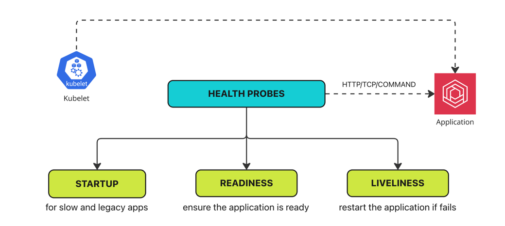

# Health Probes in Kubernetes
### What are probes?
- To investigate or monitor something and to take necessary actions

### What are health probes in Kubernetes?
- Health probes monitor your Kubernetes applications and take necessary actions to recover from failure
- To ensure your application is highly available and self-healing

### Type of health probes in Kubernetes
- Readiness ( Ensure application is ready) 
  * Readiness probes determine when a container is ready to start accepting traffic. This is useful when waiting for an application to perform time-consuming initial tasks, such as establishing network connections, loading files, and warming caches.
- Liveness ( Restart the application if health checks fail)
  * Liveness probes determine when to restart a container. For example, liveness probes could catch a deadlock when an application is running but unable to make progress.
    If a container fails its liveness probe repeatedly, the kubelet restarts the container.
- Startup ( Probes for legacy applications that need a lot of time to start)
  * A startup probe verifies whether the application within a container is started. This can be used to adopt liveness checks on slow starting containers, avoiding them getting killed by the kubelet before they are up and running.
    If such a probe is configured, it disables liveness and readiness checks until it succeeds. 
### Types of health checks they perform?
- HTTP/TCP/command

### Health probes


## Examples of liveness command

```yaml
apiVersion: v1
kind: Pod
metadata:
  labels:
    test: liveness
  name: liveness-exec
spec:
  containers:
  - name: liveness
    image: registry.k8s.io/busybox
    args:
    - /bin/sh
    - -c
    - touch /tmp/healthy; sleep 30; rm -f /tmp/healthy; sleep 600
    livenessProbe:
      exec:
        command:
        - cat 
        - /tmp/healthy
      initialDelaySeconds: 5
      periodSeconds: 5
```
```commandline
(kind-manoj-cka-cluster:N/A)   ~/Desktop/CLASS/KUBERNETES/CKA-Series/18-HEALTH-PROBES/ [main+*] kubectl apply -f livelibess-command.yml 
kubectl --context kind-manoj-cka-cluster -n default apply -f livelibess-command.yml
pod/liveness-exec created
(kind-manoj-cka-cluster:N/A)   ~/Desktop/CLASS/KUBERNETES/CKA-Series/18-HEALTH-PROBES/ [main+*] kubectl get pods                       
kubectl --context kind-manoj-cka-cluster -n default get pods
NAME            READY   STATUS    RESTARTS   AGE
liveness-exec   1/1     Running   0          7s
(kind-manoj-cka-cluster:N/A)   ~/Desktop/CLASS/KUBERNETES/CKA-Series/18-HEALTH-PROBES/ [main+*] kubectl get pods --watch
kubectl --context kind-manoj-cka-cluster -n default get pods --watch
NAME            READY   STATUS    RESTARTS   AGE
liveness-exec   1/1     Running   0          15s
liveness-exec   1/1     Running   1 (3s ago)   78s
liveness-exec   1/1     Running   2 (4s ago)   2m34s
```
Here we can see the restarts because we dont have that file hence restarting the contianer

#### liveness-http and readiness-http
```yaml
apiVersion: v1
kind: Pod
metadata:
  name: hello
spec:
  containers:
  - name: liveness
    image: registry.k8s.io/e2e-test-images/agnhost:2.40
    args:
    - liveness
    livenessProbe:
      httpGet:
        path: /healthz
        port: 8080
      initialDelaySeconds: 3
      periodSeconds: 3
    readinessProbe:
      httpGet:
        path: /healthz
        port: 8080
      initialDelaySeconds: 15
      periodSeconds: 10
```
```commandline
(kind-manoj-cka-cluster:N/A)   ~/Desktop/CLASS/KUBERNETES/CKA-Series/18-HEALTH-PROBES/ [main+*] kubectl apply -f liveliness-http.yml   
kubectl --context kind-manoj-cka-cluster -n default apply -f liveliness-http.yml
pod/hello created
(kind-manoj-cka-cluster:N/A)   ~/Desktop/CLASS/KUBERNETES/CKA-Series/18-HEALTH-PROBES/ [main+*] kubectl get pods --watch            
kubectl --context kind-manoj-cka-cluster -n default get pods --watch
NAME            READY   STATUS              RESTARTS      AGE
hello           0/1     ContainerCreating   0             4s
liveness-exec   1/1     Running             3 (74s ago)   4m59s
hello           0/1     Running             0             17s
liveness-exec   1/1     Running             4 (14s ago)   5m14s
hello           0/1     Running             1 (0s ago)    33s
```
```commandline
(kind-manoj-cka-cluster:N/A)   ~/Desktop/CLASS/KUBERNETES/CKA-Series/18-HEALTH-PROBES/ [main+*] kubectl get pods 
kubectl --context kind-manoj-cka-cluster -n default get pods
NAME            READY   STATUS             RESTARTS      AGE
hello           0/1     CrashLoopBackOff   3 (25s ago)   112s

kubectl describe pod hello
kubectl --context kind-manoj-cka-cluster -n default describe pod hello
Name:             hello
Namespace:        default
Priority:         0
Service Account:  default
Node:             manoj-cka-cluster-worker/172.18.0.2
Start Time:       Fri, 13 Dec 2024 11:45:45 +0530
Labels:           <none>
Annotations:      <none>
Status:           Running
IP:               10.244.1.20
IPs:
  IP:  10.244.1.20
Containers:
  liveness:
    Container ID:  containerd://4b3dbb012baad56eda2b1b99dd7a20d387e6abdc5be313a6fbbc6748c6b8d2d1
    Image:         registry.k8s.io/e2e-test-images/agnhost:2.40
    Image ID:      registry.k8s.io/e2e-test-images/agnhost@sha256:af7e3857d87770ddb40f5ea4f89b5a2709504ab1ee31f9ea4ab5823c045f2146
    Port:          <none>
    Host Port:     <none>
    Args:
      liveness
    State:          Running
      Started:      Fri, 13 Dec 2024 11:47:54 +0530
    Last State:     Terminated
      Reason:       Error
      Exit Code:    2
      Started:      Fri, 13 Dec 2024 11:47:37 +0530
      Finished:     Fri, 13 Dec 2024 11:47:54 +0530
    Ready:          False
    Restart Count:  5
    Liveness:       http-get http://:8080/healthz delay=3s timeout=1s period=3s #success=1 #failure=3
    Readiness:      http-get http://:8080/healthz delay=15s timeout=1s period=10s #success=1 #failure=3
    Environment:    <none>
    Mounts:
      /var/run/secrets/kubernetes.io/serviceaccount from kube-api-access-jw9jj (ro)
Conditions:
  Type                        Status
  PodReadyToStartContainers   True 
  Initialized                 True 
  Ready                       False 
  ContainersReady             False 
  PodScheduled                True 
Volumes:
  kube-api-access-jw9jj:
    Type:                    Projected (a volume that contains injected data from multiple sources)
    TokenExpirationSeconds:  3607
    ConfigMapName:           kube-root-ca.crt
    ConfigMapOptional:       <nil>
    DownwardAPI:             true
QoS Class:                   BestEffort
Node-Selectors:              <none>
Tolerations:                 node.kubernetes.io/not-ready:NoExecute op=Exists for 300s
                             node.kubernetes.io/unreachable:NoExecute op=Exists for 300s
Events:
  Type     Reason     Age                 From               Message
  ----     ------     ----                ----               -------
  Normal   Scheduled  2m18s               default-scheduler  Successfully assigned default/hello to manoj-cka-cluster-worker
  Normal   Pulling    2m18s               kubelet            Pulling image "registry.k8s.io/e2e-test-images/agnhost:2.40"
  Normal   Pulled     2m2s                kubelet            Successfully pulled image "registry.k8s.io/e2e-test-images/agnhost:2.40" in 16.418s (16.418s including waiting)
  Normal   Created    87s (x3 over 2m2s)  kubelet            Created container liveness
  Normal   Started    87s (x3 over 2m1s)  kubelet            Started container liveness
  Warning  Unhealthy  87s (x3 over 105s)  kubelet            Readiness probe failed: HTTP probe failed with statuscode: 500
  Normal   Pulled     87s (x2 over 105s)  kubelet            Container image "registry.k8s.io/e2e-test-images/agnhost:2.40" already present on machine
  Warning  Unhealthy  69s (x9 over 111s)  kubelet            Liveness probe failed: HTTP probe failed with statuscode: 500
  Normal   Killing    69s (x3 over 105s)  kubelet            Container liveness failed liveness probe, will be restarted
```

## liveness-tcp

```yaml
apiVersion: v1
kind: Pod
metadata:
  name: tcp-pod
  labels:
    app: tcp-pod
spec:
  containers:
  - name: goproxy
    image: registry.k8s.io/goproxy:0.1
    ports:
    - containerPort: 8080
    livenessProbe:
      tcpSocket:
        port: 3000
      initialDelaySeconds: 10
      periodSeconds: 5
```

```commandline
(kind-manoj-cka-cluster:N/A)   ~/Desktop/CLASS/KUBERNETES/CKA-Series/18-HEALTH-PROBES/ [main+*] kubectl apply -f liveness-tcp.yml 
kubectl --context kind-manoj-cka-cluster -n default apply -f liveness-tcp.yml
pod/tcp-pod created
(kind-manoj-cka-cluster:N/A)   ~/Desktop/CLASS/KUBERNETES/CKA-Series/18-HEALTH-PROBES/ [main+*] kubectl get pods                 
kubectl --context kind-manoj-cka-cluster -n default get pods
NAME      READY   STATUS              RESTARTS   AGE
tcp-pod   0/1     ContainerCreating   0          3s
(kind-manoj-cka-cluster:N/A)   ~/Desktop/CLASS/KUBERNETES/CKA-Series/18-HEALTH-PROBES/ [main+*] kubectl get pods --watch
kubectl --context kind-manoj-cka-cluster -n default get pods --watch
NAME      READY   STATUS    RESTARTS   AGE
tcp-pod   1/1     Running   0          7s
tcp-pod   1/1     Running   1 (1s ago)   26s
tcp-pod   1/1     Running   2 (1s ago)   46s


kubectl describe pod tcp-pod 
kubectl --context kind-manoj-cka-cluster -n default describe pod tcp-pod
Name:             tcp-pod
Namespace:        default
Priority:         0
Service Account:  default
Node:             manoj-cka-cluster-worker/172.18.0.2
Start Time:       Fri, 13 Dec 2024 11:50:07 +0530
Labels:           app=tcp-pod
Annotations:      <none>
Status:           Running
IP:               10.244.1.21
IPs:
  IP:  10.244.1.21
Containers:
  goproxy:
    Container ID:   containerd://11f1f6632b1eb090e1477d12df529e92a9300a1a533bf4249670b1e85747430f
    Image:          registry.k8s.io/goproxy:0.1
    Image ID:       registry.k8s.io/goproxy@sha256:5334c7ad43048e3538775cb09aaf184f5e8acf4b0ea60e3bc8f1d93c209865a5
    Port:           8080/TCP
    Host Port:      0/TCP
    State:          Running
      Started:      Fri, 13 Dec 2024 11:50:53 +0530
    Last State:     Terminated
      Reason:       Error
      Exit Code:    2
      Started:      Fri, 13 Dec 2024 11:50:32 +0530
      Finished:     Fri, 13 Dec 2024 11:50:52 +0530
    Ready:          True
    Restart Count:  2
    Liveness:       tcp-socket :3000 delay=10s timeout=1s period=5s #success=1 #failure=3
    Environment:    <none>
    Mounts:
      /var/run/secrets/kubernetes.io/serviceaccount from kube-api-access-6st9p (ro)
Conditions:
  Type                        Status
  PodReadyToStartContainers   True 
  Initialized                 True 
  Ready                       True 
  ContainersReady             True 
  PodScheduled                True 
Volumes:
  kube-api-access-6st9p:
    Type:                    Projected (a volume that contains injected data from multiple sources)
    TokenExpirationSeconds:  3607
    ConfigMapName:           kube-root-ca.crt
    ConfigMapOptional:       <nil>
    DownwardAPI:             true
QoS Class:                   BestEffort
Node-Selectors:              <none>
Tolerations:                 node.kubernetes.io/not-ready:NoExecute op=Exists for 300s
                             node.kubernetes.io/unreachable:NoExecute op=Exists for 300s
Events:
  Type     Reason     Age                From               Message
  ----     ------     ----               ----               -------
  Normal   Scheduled  69s                default-scheduler  Successfully assigned default/tcp-pod to manoj-cka-cluster-worker
  Normal   Pulling    69s                kubelet            Pulling image "registry.k8s.io/goproxy:0.1"
  Normal   Pulled     65s                kubelet            Successfully pulled image "registry.k8s.io/goproxy:0.1" in 3.833s (3.833s including waiting)
  Normal   Created    24s (x3 over 65s)  kubelet            Created container goproxy
  Normal   Killing    24s (x2 over 44s)  kubelet            Container goproxy failed liveness probe, will be restarted
  Normal   Pulled     24s (x2 over 44s)  kubelet            Container image "registry.k8s.io/goproxy:0.1" already present on machine
  Normal   Started    23s (x3 over 65s)  kubelet            Started container goproxy
  Warning  Unhealthy  4s (x8 over 54s)   kubelet            Liveness probe failed: dial tcp 10.244.1.21:3000: connect: connection refused
```


