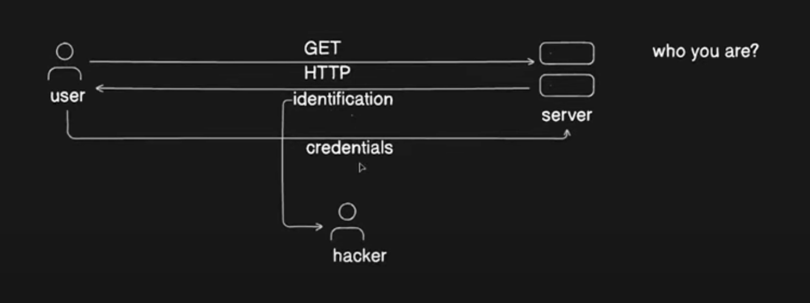

# TLS AND SSL

TLS (Transport Layer Security) and SSL (Secure Sockets Layer) are cryptographic protocols used to secure communication over computer networks, 
most commonly in web browsers and servers. 
The two protocols are essentially aimed at providing encryption, integrity, and authentication for online communication, though SSL has been largely replaced by TLS due to security vulnerabilities.

### 1. Basic Concept
TLS/SSL protocols use asymmetric encryption (public-key cryptography) for establishing secure communication and symmetric encryption for the actual data transfer. They provide:

**Encryption:** Ensures that the data exchanged between the client (e.g., browser) and the server is unreadable to third parties.
**Integrity:** Ensures that the data has not been altered during transmission.
**Authentication:** Confirms that the client is talking to the correct server and not an imposter.

### 2. How SSL/TLS Works (Handshake Process)
When you visit a website, your browser and the web server need to perform a handshake to establish a secure connection. Here's how it works step-by-step in a TLS/SSL handshake:

**Step-by-Step Example:**
Let’s say you’re trying to access a website like https://example.com. Here’s how the TLS handshake would work:

### 1.Client Hello:
You (the browser) initiate a connection to the server. The client sends a "Hello" message to the server, which includes:
Supported encryption algorithms (cipher suites).
A random number for the session.
Other information like supported versions of SSL/TLS.

### 2.Server Hello:
The server responds with:
A "Hello" message that includes the server’s selected cipher suite (from the list provided by the client).
A random number generated by the server.
The server’s SSL/TLS certificate (which includes the server’s public key).

### 3.Certificate Validation:
Your browser (client) now checks the server's SSL/TLS certificate. This certificate is issued by a trusted Certificate Authority (CA). The certificate proves the server’s identity.
If the certificate is valid and the server's identity is verified, the connection continues. If the certificate is not valid, you might see a warning like "This site is not secure."

### 4.Key Exchange (Session Keys):
Using the server’s public key (from the certificate), the client generates a pre-master secret and encrypts it using the server’s public key. This ensures only the server can decrypt it (since only the server has the corresponding private key).
Both the client and the server now use this pre-master secret, along with the random numbers exchanged earlier, to generate the session key (a symmetric key) for encrypting the actual data during the session.

### 5.Client Finished:
The client sends a message to the server, indicating that the handshake is complete, and the data is now encrypted using the session key.

### 6.Server Finished:
The server sends a similar message to the client, indicating that the handshake is complete.
At this point, a secure connection is established, and data transfer begins using symmetric encryption (since symmetric encryption is faster than asymmetric encryption).

At this point, a secure connection is established, and data transfer begins using symmetric encryption (since symmetric encryption is faster than asymmetric encryption).

## 3. Example Scenario (Real World)

Scenario: You are accessing an e-commerce website https://shop.com

### 1.Client Request:
You enter https://shop.com in your browser’s address bar. The browser starts the SSL/TLS handshake by sending a "Client Hello" message.

### 2.Server Response:
The web server at shop.com replies with its "Server Hello" message, providing its SSL/TLS certificate (with a public key), and choosing a cipher suite for the session.

### 3.Certificate Validation:
Your browser checks if the certificate was issued by a trusted Certificate Authority (e.g., DigiCert, Let's Encrypt). If the certificate is valid, the browser proceeds; otherwise, it shows a warning that the site may not be trusted.

### 4.Key Exchange:
Your browser and the server agree on a session key that will be used to encrypt and decrypt the communication during the session. This is done using the public/private key pair (asymmetric encryption) initially and then switching to a shared symmetric session key for actual data encryption.

### 5.Encrypted Data Transfer:
Now, every piece of information you exchange with the website (like filling out a form, adding items to the shopping cart, or entering payment details) is encrypted using symmetric encryption.

### 6.Session Termination:
Once the session is over, the session key is discarded, and no further communication will use that same key.

## 4. Key Differences: SSL vs TLS

**SSL:** Was the first widely adopted protocol for securing web communications. It has known vulnerabilities, so it is now considered obsolete and deprecated.

**TLS:** An updated version of SSL. It offers more secure encryption algorithms and stronger integrity checks. The names SSL and TLS are often used interchangeably, but SSL is no longer recommended for use in modern web applications.

## 5. Real-World Application Example
Online Banking: When you log into your bank's website, your browser uses TLS to encrypt your username, password, and any transactions to prevent hackers from eavesdropping or altering your sensitive information.

E-Commerce Websites: When shopping online, SSL/TLS encrypts your credit card information, ensuring that it’s securely transmitted to the payment gateway for processing.

## 6. Conclusion
In summary, SSL/TLS enables secure communication by using encryption and authentication. Through the handshake process, the client and server agree on how they will securely exchange data, ensuring privacy and data integrity. While SSL is an older protocol and is mostly replaced by TLS, the two are conceptually similar, and you’ll still hear people referring to SSL when they mean TLS.