# TLS AND SSL

TLS (Transport Layer Security) and SSL (Secure Sockets Layer) are cryptographic protocols used to secure communication over computer networks, 
most commonly in web browsers and servers. 
The two protocols are essentially aimed at providing encryption, integrity, and authentication for online communication, though SSL has been largely replaced by TLS due to security vulnerabilities.

# How TLS or SSL works
Its Always client and server interaction

1. User may send request either get put post to the server 
    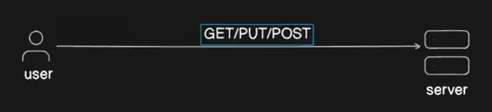
2. For now Lets assume use sends Get request with Http protocal
  **HTTP** is Hypertext Transfer Protocol
  **HTTPS** is Hypertext Transfer Protocol Secure.

**HTTP** is a protocol used for transmitting hypertext via the internet. It defines how messages are formatted and transmitted and how web servers and browsers respond to various commands.
**HTTPS** is the secure version of HTTP. The "S" at the end stands for "Secure," meaning the data transferred between the web browser and the server is encrypted using SSL/TLS (Secure Sockets Layer/Transport Layer Security). This provides a higher level of security, especially for transactions involving sensitive data like passwords or payment information.

3.When user sends request first it will ask for identification
4.Then User sends the credentials. here authentication means who you are ..?
    
5.Now if someone sending the credentials in the unsecure website or site  Hacker will be in middle and he may sniff the data.
    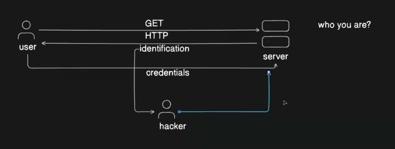

If you are using only basic web application that is fine but what if bank or secured application

This wont work

## Now to secure the connection we will go for encryption method

1. When encrypt the data he will that means identification key
    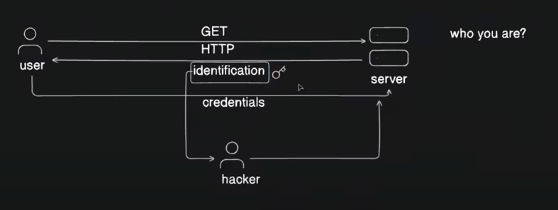
2. Now identification key is generated at the user end and this key he needs to send to server as well because it as to decrypt the data
    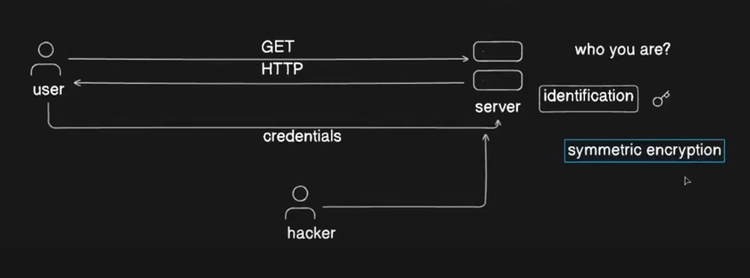
3. This is type of sending key to server is called symetric encryption
4. Same key is used to encrypt and decrypt the data
5. But it has loophole, Lets user sending identification again hacker can get that identification key 
   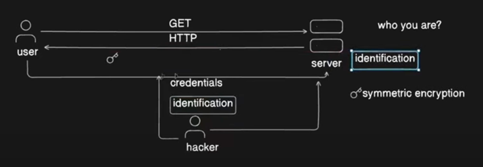
6. And when you are sending the key to server because sever need key to decrypt the data at that time hacker get hold of that key
   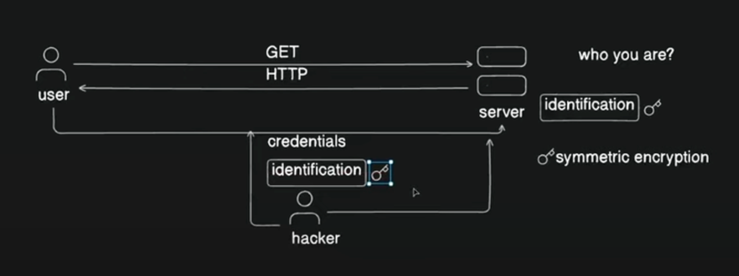
7. So in this case hacker also do the same hence we are compromised thats why we should symetric encryption is not recomended 

## Now How assemtric encryption works..
1. Now we are going with private and public key configuration. we can create that private and public key via ssh utility
   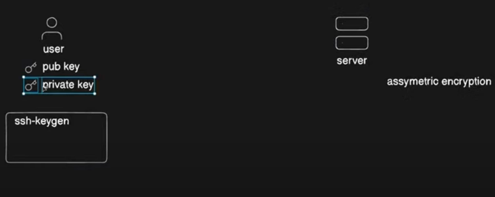
2. We have add ssh keys to .ssh/autherised keys in the servers
   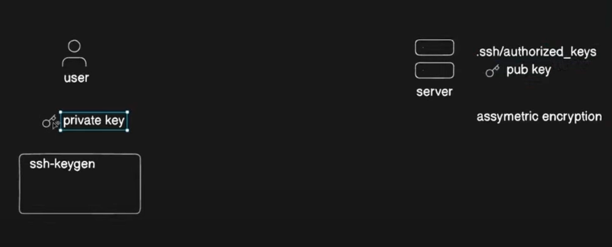
3. How ssh key works in the sense see below when we do ssh-copy-id it will copy both private and public id in the server level
   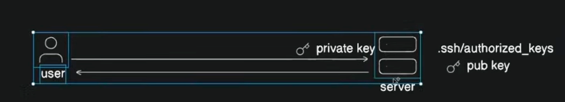
4. Now Lets see how in the internet it works

## How we can generate via internet

1. key can be generate via **openssl**
2. In the server by using openssl we have created the private and public key and now we need to retain the private key in the server
   Need to send public key via GET call
   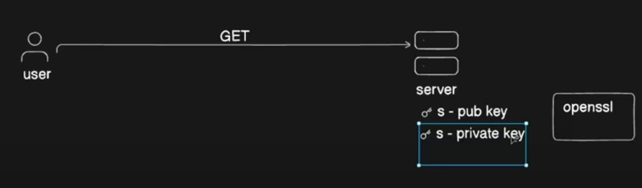
3. Now in the user side we will create symetric key 
   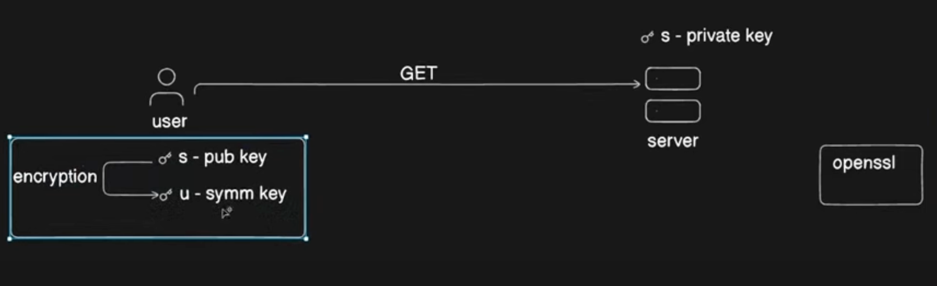
4. So User can only see encrpted data since he cat get hold of private key that is no use for the hacker
   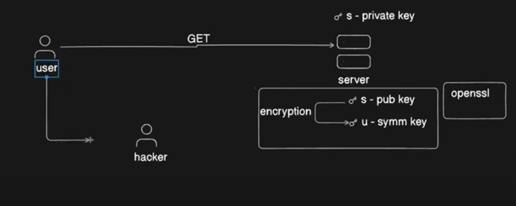
5. But Now here also we have one more loop if user mistakenly uses the hackers website or hacker links then hacker will get the private key
   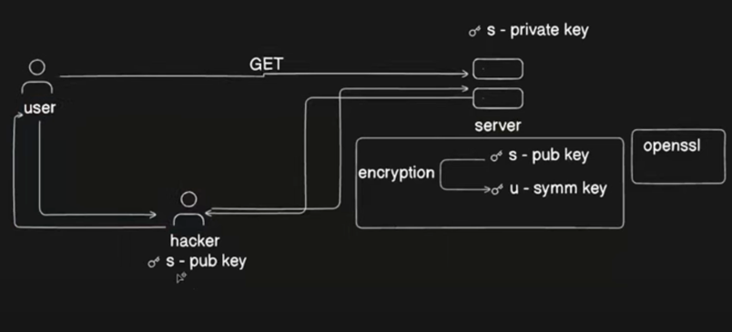

## There is way that we can identify the user who is right user from the the right site

We can validate via cerificates
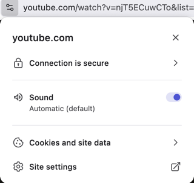
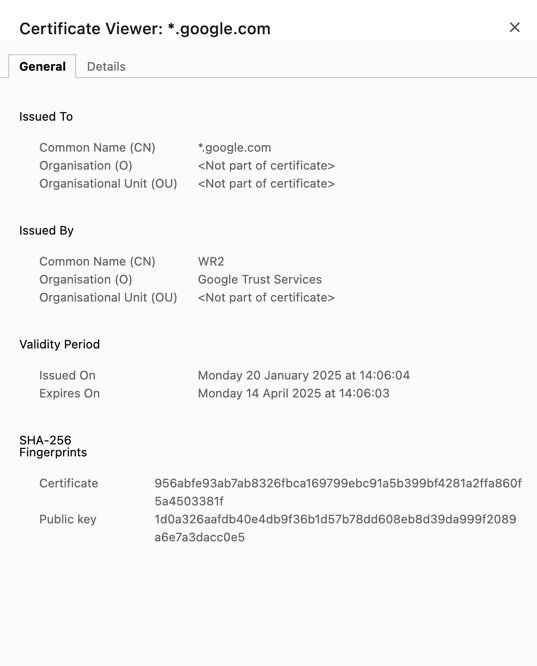
certificate validation

Server certificate signing request 
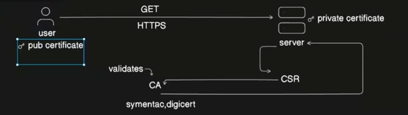

