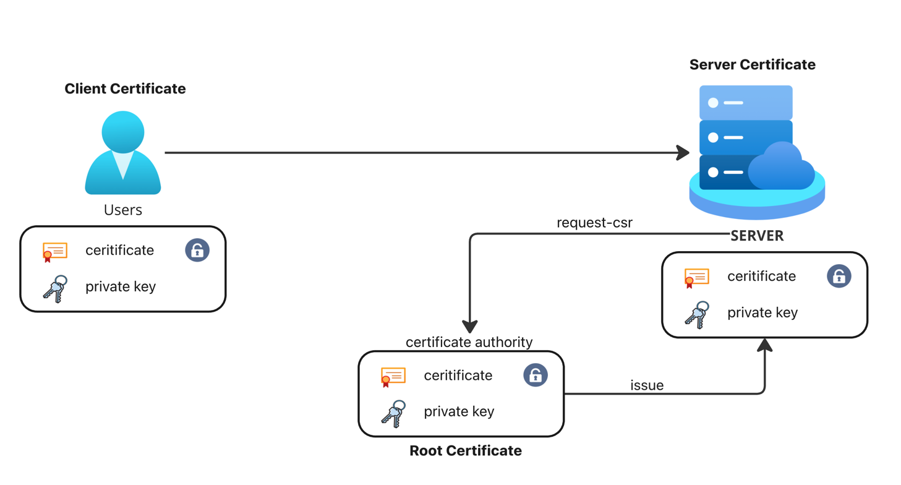
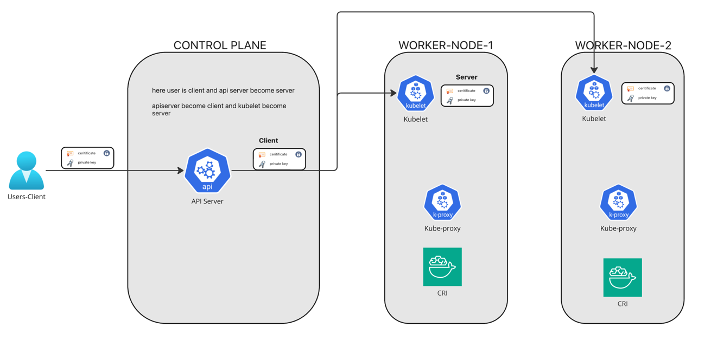
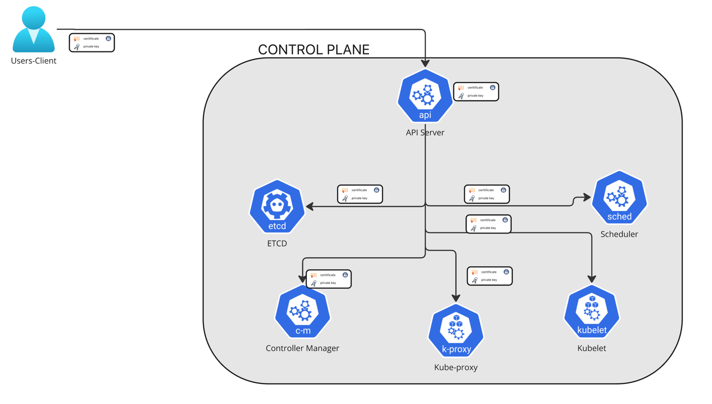

# Manage TLS Certificates In a Kubernetes Cluster

## TLS in Kubernetes


Managing TLS certificates in a Kubernetes cluster is crucial for ensuring secure communication between different services and components, such as between pods, services, and external clients. TLS (Transport Layer Security) ensures that traffic is encrypted and authenticated, protecting the data in transit. In Kubernetes, TLS certificates are commonly used for:

Securing communication between Pods (e.g., between microservices).
Securing communication with the Kubernetes API server.
Ensuring secure ingress traffic (e.g., HTTPS for external clients).



### Three types of certificates here..
1. Client Certificate
2. Root Certificate
3. Server Certificate

## How TLS Works in Kubernetes
In Kubernetes, TLS certificates play a vital role in securing traffic within the cluster. Here are a few common use cases:

### Pod-to-Pod Communication (Internal TLS):
When one service (pod) communicates with another (e.g., a microservice calling a database), it may use mutual TLS (mTLS) to ensure that both the client and server authenticate each other and encrypt the data. This is often configured using Istio, Linkerd, or other service meshes.

### Ingress Controllers (External TLS):
Ingress controllers manage external HTTP/HTTPS traffic to your services. TLS certificates are used to encrypt traffic between clients and the ingress controller, which then routes traffic to the appropriate service.
Common ingress controllers that support TLS include NGINX Ingress Controller and Traefik.

### API Server and etcd Communication:
The Kubernetes API server and etcd (the key-value store) use TLS for secure communication.
The Kubernetes API server, kubelets, and other components communicate with each other over HTTPS, typically using certificates stored in Kubernetes secrets.



### control plane component communication



## How to issue a certificate for a user

### Create private key
ref: https://kubernetes.io/docs/reference/access-authn-authz/certificate-signing-requests/

```commandline
openssl genrsa -out vinoth.key 2048
openssl req -new -key vinoth.key -out vinoth.csr -subj "/CN=vinoth"


01:22:10 manojkrishnappa@Manojs-MacBook-Pro 21-TLS-KUBE ±|main ✗|→ cat vinoth.csr | base64 | tr -d "\n"
LS0tLS1CRUdJTiBDRVJUSUZJQ0FURSBSRVFVRVNULS0tLS0KTUlJQ1ZqQ0NBVDRDQVFBd0VURVBNQTBHQTFVRUF3d0dkbWx1YjNSb01JSUJJakFOQmdrcWhraUc5dzBCQVFFRgpBQU9DQVE4QU1JSUJDZ0tDQVFFQXZ2azE4cEJKUkgvc2ppOXEzWlRRNXIzVDl5VWVqeHpRWFMyalQwM3o3cVZ3CjM0TkdCd2VBZmE3TzhFbHRYN3BHNkR4NHcrNXlxczZYSm9Ddzhxc1BnR1JwQVpXU1VnKzEzSFcvMVNrUXZuYlgKVHppNzZOTG1SUjJJRU5uOGc2VzJaRWVTNlFDRk5KTG1scE8zK0RNSnpTb1UvcFgvL21RaFJ4S0xWa0RFdlJ2VQpiRXZQNTdMWVV6ODRvS3diRXVkbG1iUVYxUGhSaXZxWURRT2Zkbi9Pc3F0Vm5tUlg3Z2FGSndtMHpVeUdGak9rCnhkSklUZG1BYmYzYjZtQkg3Ukc1bnlwR3oxNm15Qm5KSFpNdEtzeXRVNmc1azhJMU9xSkp1UHFURm80MSs1ZFMKTVVtdHZFQU9vTGpGK0NYZkV1alhQRzRNU3hUSVBnZFRIMlNpblZZSDd3SURBUUFCb0FBd0RRWUpLb1pJaHZjTgpBUUVMQlFBRGdnRUJBRDZQYzVZMmhLVStXR2FQY1NoSTZjSzRFMy9ZWGRWaXlkazNWbnVJNnM2MWZkNWZhWEJWCnNCUzZVc1NMNFJaY3VuRk53eXN4eEN1V1NzeFVoVUVNUng2YStxRjcxSXhhTTUvb2NRWmFtaHBqeVo4cElpanYKaERLNkttQ0w4NFhFQ08yTi9lYng4aEJGZHJWK0RUTTBDY3pkRldLZ3JXckFrbU8wa2tCTlNXblhHWHRZYWtQUQoyWFU5SVNtcDlmQ1BWRng0WG1TMURraldsc0k4dE0rN2poZEZ4Y29Fc0prTk9QMTV1LzNSbm1SRkZxODBRSTRTClFodk04em84bW5EZnkwUm1vMFFlZ2FybUZpYXh2TS82UmxoWHJ4STRlUUptOXQ4TDlpSXB6ejZPZE9qZ3hTMHkKbWR3NnFuM095V1RaZDVWQTVnMjFXNWJRNEJxVlM4NTJ6ckE9Ci0tLS0tRU5EIENFUlRJRklDQVRFIFJFUVVFU1QtLS0tLQo= 


```

add that in csr.yml

```yaml
apiVersion: certificates.k8s.io/v1
kind: CertificateSigningRequest
metadata:
  name: myuser
spec:
  request: LS0tLS1CRUdJTiBDRVJUSUZJQ0FURSBSRVFVRVNULS0tLS0KTUlJQ1ZqQ0NBVDRDQVFBd0VURVBNQTBHQTFVRUF3d0dZVzVuWld4aE1JSUJJakFOQmdrcWhraUc5dzBCQVFFRgpBQU9DQVE4QU1JSUJDZ0tDQVFFQTByczhJTHRHdTYxakx2dHhWTTJSVlRWMDNHWlJTWWw0dWluVWo4RElaWjBOCnR2MUZtRVFSd3VoaUZsOFEzcWl0Qm0wMUFSMkNJVXBGd2ZzSjZ4MXF3ckJzVkhZbGlBNVhwRVpZM3ExcGswSDQKM3Z3aGJlK1o2MVNrVHF5SVBYUUwrTWM5T1Nsbm0xb0R2N0NtSkZNMUlMRVI3QTVGZnZKOEdFRjJ6dHBoaUlFMwpub1dtdHNZb3JuT2wzc2lHQ2ZGZzR4Zmd4eW8ybmlneFNVekl1bXNnVm9PM2ttT0x1RVF6cXpkakJ3TFJXbWlECklmMXBMWnoyalVnald4UkhCM1gyWnVVV1d1T09PZnpXM01LaE8ybHEvZi9DdS8wYk83c0x0MCt3U2ZMSU91TFcKcW90blZtRmxMMytqTy82WDNDKzBERHk5aUtwbXJjVDBnWGZLemE1dHJRSURBUUFCb0FBd0RRWUpLb1pJaHZjTgpBUUVMQlFBRGdnRUJBR05WdmVIOGR4ZzNvK21VeVRkbmFjVmQ1N24zSkExdnZEU1JWREkyQTZ1eXN3ZFp1L1BVCkkwZXpZWFV0RVNnSk1IRmQycVVNMjNuNVJsSXJ3R0xuUXFISUh5VStWWHhsdnZsRnpNOVpEWllSTmU3QlJvYXgKQVlEdUI5STZXT3FYbkFvczFqRmxNUG5NbFpqdU5kSGxpT1BjTU1oNndLaTZzZFhpVStHYTJ2RUVLY01jSVUyRgpvU2djUWdMYTk0aEpacGk3ZnNMdm1OQUxoT045UHdNMGM1dVJVejV4T0dGMUtCbWRSeEgvbUNOS2JKYjFRQm1HCkkwYitEUEdaTktXTU0xMzhIQXdoV0tkNjVoVHdYOWl4V3ZHMkh4TG1WQzg0L1BHT0tWQW9FNkpsYWFHdTlQVmkKdjlOSjVaZlZrcXdCd0hKbzZXdk9xVlA3SVFjZmg3d0drWm89Ci0tLS0tRU5EIENFUlRJRklDQVRFIFJFUVVFU1QtLS0tLQo=
  signerName: kubernetes.io/kube-apiserver-client
  expirationSeconds: 86400  # one day
  usages:
  - client auth
```

```commandline
01:27:25 manojkrishnappa@Manojs-MacBook-Pro 21-TLS-KUBE ±|main ✗|→ kubectl apply -f csr.yml 
certificatesigningrequest.certificates.k8s.io/vinoth created

01:27:30 manojkrishnappa@Manojs-MacBook-Pro 21-TLS-KUBE ±|main ✗|→ kubectl get csr
NAME     AGE   SIGNERNAME                            REQUESTOR          REQUESTEDDURATION   CONDITION
vinoth   2s    kubernetes.io/kube-apiserver-client   kubernetes-admin   24h                 Pending

01:27:32 manojkrishnappa@Manojs-MacBook-Pro 21-TLS-KUBE ±|main ✗|→ kubectl describe csr vinoth
Name:         vinoth
Labels:       <none>
Annotations:  kubectl.kubernetes.io/last-applied-configuration={"apiVersion":"certificates.k8s.io/v1","kind":"CertificateSigningRequest","metadata":{"annotations":{},"name":"vinoth"},"spec":{"expirationSeconds":86400,"request":"LS0tLS1CRUdJTiBDRVJUSUZJQ0FURSBSRVFVRVNULS0tLS0KTUlJQ1ZqQ0NBVDRDQVFBd0VURVBNQTBHQTFVRUF3d0dkbWx1YjNSb01JSUJJakFOQmdrcWhraUc5dzBCQVFFRgpBQU9DQVE4QU1JSUJDZ0tDQVFFQXZ2azE4cEJKUkgvc2ppOXEzWlRRNXIzVDl5VWVqeHpRWFMyalQwM3o3cVZ3CjM0TkdCd2VBZmE3TzhFbHRYN3BHNkR4NHcrNXlxczZYSm9Ddzhxc1BnR1JwQVpXU1VnKzEzSFcvMVNrUXZuYlgKVHppNzZOTG1SUjJJRU5uOGc2VzJaRWVTNlFDRk5KTG1scE8zK0RNSnpTb1UvcFgvL21RaFJ4S0xWa0RFdlJ2VQpiRXZQNTdMWVV6ODRvS3diRXVkbG1iUVYxUGhSaXZxWURRT2Zkbi9Pc3F0Vm5tUlg3Z2FGSndtMHpVeUdGak9rCnhkSklUZG1BYmYzYjZtQkg3Ukc1bnlwR3oxNm15Qm5KSFpNdEtzeXRVNmc1azhJMU9xSkp1UHFURm80MSs1ZFMKTVVtdHZFQU9vTGpGK0NYZkV1alhQRzRNU3hUSVBnZFRIMlNpblZZSDd3SURBUUFCb0FBd0RRWUpLb1pJaHZjTgpBUUVMQlFBRGdnRUJBRDZQYzVZMmhLVStXR2FQY1NoSTZjSzRFMy9ZWGRWaXlkazNWbnVJNnM2MWZkNWZhWEJWCnNCUzZVc1NMNFJaY3VuRk53eXN4eEN1V1NzeFVoVUVNUng2YStxRjcxSXhhTTUvb2NRWmFtaHBqeVo4cElpanYKaERLNkttQ0w4NFhFQ08yTi9lYng4aEJGZHJWK0RUTTBDY3pkRldLZ3JXckFrbU8wa2tCTlNXblhHWHRZYWtQUQoyWFU5SVNtcDlmQ1BWRng0WG1TMURraldsc0k4dE0rN2poZEZ4Y29Fc0prTk9QMTV1LzNSbm1SRkZxODBRSTRTClFodk04em84bW5EZnkwUm1vMFFlZ2FybUZpYXh2TS82UmxoWHJ4STRlUUptOXQ4TDlpSXB6ejZPZE9qZ3hTMHkKbWR3NnFuM095V1RaZDVWQTVnMjFXNWJRNEJxVlM4NTJ6ckE9Ci0tLS0tRU5EIENFUlRJRklDQVRFIFJFUVVFU1QtLS0tLQo=","signerName":"kubernetes.io/kube-apiserver-client","usages":["client auth"]}}

CreationTimestamp:   Mon, 16 Dec 2024 13:27:30 +0530
Requesting User:     kubernetes-admin
Signer:              kubernetes.io/kube-apiserver-client
Requested Duration:  24h
Status:              Pending
Subject:
         Common Name:    vinoth
         Serial Number:  
Events:  <none>

```

```commandline
01:28:11 manojkrishnappa@Manojs-MacBook-Pro 21-TLS-KUBE ±|main ✗|→ kubectl certificate approve vinoth
certificatesigningrequest.certificates.k8s.io/vinoth approved
01:28:44 manojkrishnappa@Manojs-MacBook-Pro 21-TLS-KUBE ±|main ✗|→ kubectl get csr
NAME     AGE   SIGNERNAME                            REQUESTOR          REQUESTEDDURATION   CONDITION
vinoth   77s   kubernetes.io/kube-apiserver-client   kubernetes-admin   24h                 Approved,Issued
01:28:47 manojkrishnappa@Manojs-MacBook-Pro 21-TLS-KUBE ±|main ✗|→ kubectl describe csr vinoth
Name:         vinoth
Labels:       <none>
Annotations:  kubectl.kubernetes.io/last-applied-configuration={"apiVersion":"certificates.k8s.io/v1","kind":"CertificateSigningRequest","metadata":{"annotations":{},"name":"vinoth"},"spec":{"expirationSeconds":86400,"request":"LS0tLS1CRUdJTiBDRVJUSUZJQ0FURSBSRVFVRVNULS0tLS0KTUlJQ1ZqQ0NBVDRDQVFBd0VURVBNQTBHQTFVRUF3d0dkbWx1YjNSb01JSUJJakFOQmdrcWhraUc5dzBCQVFFRgpBQU9DQVE4QU1JSUJDZ0tDQVFFQXZ2azE4cEJKUkgvc2ppOXEzWlRRNXIzVDl5VWVqeHpRWFMyalQwM3o3cVZ3CjM0TkdCd2VBZmE3TzhFbHRYN3BHNkR4NHcrNXlxczZYSm9Ddzhxc1BnR1JwQVpXU1VnKzEzSFcvMVNrUXZuYlgKVHppNzZOTG1SUjJJRU5uOGc2VzJaRWVTNlFDRk5KTG1scE8zK0RNSnpTb1UvcFgvL21RaFJ4S0xWa0RFdlJ2VQpiRXZQNTdMWVV6ODRvS3diRXVkbG1iUVYxUGhSaXZxWURRT2Zkbi9Pc3F0Vm5tUlg3Z2FGSndtMHpVeUdGak9rCnhkSklUZG1BYmYzYjZtQkg3Ukc1bnlwR3oxNm15Qm5KSFpNdEtzeXRVNmc1azhJMU9xSkp1UHFURm80MSs1ZFMKTVVtdHZFQU9vTGpGK0NYZkV1alhQRzRNU3hUSVBnZFRIMlNpblZZSDd3SURBUUFCb0FBd0RRWUpLb1pJaHZjTgpBUUVMQlFBRGdnRUJBRDZQYzVZMmhLVStXR2FQY1NoSTZjSzRFMy9ZWGRWaXlkazNWbnVJNnM2MWZkNWZhWEJWCnNCUzZVc1NMNFJaY3VuRk53eXN4eEN1V1NzeFVoVUVNUng2YStxRjcxSXhhTTUvb2NRWmFtaHBqeVo4cElpanYKaERLNkttQ0w4NFhFQ08yTi9lYng4aEJGZHJWK0RUTTBDY3pkRldLZ3JXckFrbU8wa2tCTlNXblhHWHRZYWtQUQoyWFU5SVNtcDlmQ1BWRng0WG1TMURraldsc0k4dE0rN2poZEZ4Y29Fc0prTk9QMTV1LzNSbm1SRkZxODBRSTRTClFodk04em84bW5EZnkwUm1vMFFlZ2FybUZpYXh2TS82UmxoWHJ4STRlUUptOXQ4TDlpSXB6ejZPZE9qZ3hTMHkKbWR3NnFuM095V1RaZDVWQTVnMjFXNWJRNEJxVlM4NTJ6ckE9Ci0tLS0tRU5EIENFUlRJRklDQVRFIFJFUVVFU1QtLS0tLQo=","signerName":"kubernetes.io/kube-apiserver-client","usages":["client auth"]}}

CreationTimestamp:   Mon, 16 Dec 2024 13:27:30 +0530
Requesting User:     kubernetes-admin
Signer:              kubernetes.io/kube-apiserver-client
Requested Duration:  24h
Status:              Approved,Issued
Subject:
         Common Name:    vinoth
         Serial Number:  
Events:  <none>
q
```

