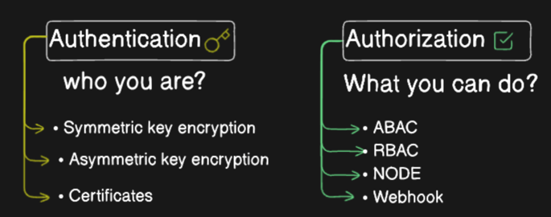

# Kubernetes Authentication and Authorization

## Authentication: Verifying Who You Are
Imagine your cluster is a fortress. 
Authentication is like checking IDs at the gate. Kubeconfig is your keycard containing certificates that identify you to the Kubernetes API server.



**Making API Calls:**
bashnst a cluster, you can use the below command

kubectl get pods --kubeconfig config

### Making API Calls:

To run a command against a cluster, you can use the below command
```
kubectl get pods --kubeconfig config
```

Normally, kubectl uses your local `$HOME/.kube/config` file for authentication so you dont have to pass the --kubeconfig parameter in every command. You can use below command
```
kubectl get pods
```

The below command shows an API call using raw arguments:

```
kubectl get --raw /api/v1/namespaces/default/pods \
  --server https://localhost:64418 \
  --client-key adam.key \
  --client-certificate adam.crt \
  --certificate-authority ca.crt
```

### Authorization: What You Can Do

Authorization is like granting access levels within the fortress. Kubernetes offers different methods:

- Node Authorizer: Ensures kubelets on nodes are authorized to communicate with the API server.
- ABAC (Attribute-Based Access Control): Associates users with permissions but can be complex to manage.
- RBAC (Role-Based Access Control): The recommended approach! You create roles (like "dev") and assign users or groups to those roles.
- Webhooks (Optional): Leverage external tools like OPA for more complex authorization logic.

### Authorization Modes:

The API server can be configured with different authorization modes (like "always allow" or "always deny"), but these are for testing only.  In practice, a priority sequence is used as below:-

- Node Authorizer: Checks node communication.
- RBAC: Grants access based on assigned roles.
- Webhook (if enabled): Performs additional authorization checks.

### Remember:

- Authentication verifies your identity.
- Authorization determines your access level.
- RBAC is a user-friendly and recommended way to manage authorization.
- Keep exploring, Kubernetes ninjas!   There's more to discover in the video about configuring authentication and authorization in your cluster.


```commandline
(N/A:N/A)   ~/Desktop/CLASS/KUBERNETES/CKA-Series/ [main*] kubectl get nodes
kubectl --context kind-manoj-cka-cluster -n default get nodes
NAME                              STATUS   ROLES           AGE   VERSION
manoj-cka-cluster-control-plane   Ready    control-plane   40d   v1.31.2
manoj-cka-cluster-worker          Ready    <none>          40d   v1.31.2
manoj-cka-cluster-worker2         Ready    <none>          40d   v1.31.2
manoj-cka-cluster-worker3         Ready    <none>          40d   v1.31.2
(N/A:N/A)   ~/Desktop/CLASS/KUBERNETES/CKA-Series/ [main*] docker exec -it manoj-cka-cluster-control-plane /bin/bash
root@manoj-cka-cluster-control-plane:/# 

```

```commandline
(N/A:N/A)   ~/Desktop/CLASS/KUBERNETES/CKA-Series/ [main*] docker exec -it manoj-cka-cluster-control-plane /bin/bash
root@manoj-cka-cluster-control-plane:/# 
root@manoj-cka-cluster-control-plane:/# cd /etc/kubernetes/manifests/
root@manoj-cka-cluster-control-plane:/etc/kubernetes/manifests# ls
etcd.yaml  kube-apiserver.yaml  kube-controller-manager.yaml  kube-scheduler.yaml
root@manoj-cka-cluster-control-plane:/etc/kubernetes/manifests# cat kube-apiserver.yaml
apiVersion: v1
kind: Pod
metadata:
  annotations:
    kubeadm.kubernetes.io/kube-apiserver.advertise-address.endpoint: 172.18.0.4:6443
  creationTimestamp: null
  labels:
    component: kube-apiserver
    tier: control-plane
  name: kube-apiserver
  namespace: kube-system
spec:
  containers:
  - command:
    - kube-apiserver
    - --advertise-address=172.18.0.4
    - --allow-privileged=true
    - --authorization-mode=Node,RBAC
    - --client-ca-file=/etc/kubernetes/pki/ca.crt
    - --enable-admission-plugins=NodeRestriction
    - --enable-bootstrap-token-auth=true
    - --etcd-cafile=/etc/kubernetes/pki/etcd/ca.crt
    - --etcd-certfile=/etc/kubernetes/pki/apiserver-etcd-client.crt
    - --etcd-keyfile=/etc/kubernetes/pki/apiserver-etcd-client.key
    - --etcd-servers=https://127.0.0.1:2379
    - --kubelet-client-certificate=/etc/kubernetes/pki/apiserver-kubelet-client.crt
    - --kubelet-client-key=/etc/kubernetes/pki/apiserver-kubelet-client.key
    - --kubelet-preferred-address-types=InternalIP,ExternalIP,Hostname
    - --proxy-client-cert-file=/etc/kubernetes/pki/front-proxy-client.crt
    - --proxy-client-key-file=/etc/kubernetes/pki/front-proxy-client.key
    - --requestheader-allowed-names=front-proxy-client
    - --requestheader-client-ca-file=/etc/kubernetes/pki/front-proxy-ca.crt
    - --requestheader-extra-headers-prefix=X-Remote-Extra-
    - --requestheader-group-headers=X-Remote-Group
    - --requestheader-username-headers=X-Remote-User
    - --runtime-config=
    - --secure-port=6443
    - --service-account-issuer=https://kubernetes.default.svc.cluster.local
    - --service-account-key-file=/etc/kubernetes/pki/sa.pub
    - --service-account-signing-key-file=/etc/kubernetes/pki/sa.key
    - --service-cluster-ip-range=10.96.0.0/16
    - --tls-cert-file=/etc/kubernetes/pki/apiserver.crt
    - --tls-private-key-file=/etc/kubernetes/pki/apiserver.key
    image: registry.k8s.io/kube-apiserver:v1.31.2
    imagePullPolicy: IfNotPresent
    livenessProbe:
      failureThreshold: 8
      httpGet:
        host: 172.18.0.4
        path: /livez
        port: 6443
        scheme: HTTPS
      initialDelaySeconds: 10
      periodSeconds: 10
      timeoutSeconds: 15
    name: kube-apiserver
    readinessProbe:
      failureThreshold: 3
      httpGet:
        host: 172.18.0.4
        path: /readyz
        port: 6443
        scheme: HTTPS
      periodSeconds: 1
      timeoutSeconds: 15
    resources:
      requests:
        cpu: 250m
    startupProbe:
      failureThreshold: 24
      httpGet:
        host: 172.18.0.4
        path: /livez
        port: 6443
        scheme: HTTPS
      initialDelaySeconds: 10
      periodSeconds: 10
      timeoutSeconds: 15
    volumeMounts:
    - mountPath: /etc/ssl/certs
      name: ca-certs
      readOnly: true
    - mountPath: /etc/ca-certificates
      name: etc-ca-certificates
      readOnly: true
    - mountPath: /etc/kubernetes/pki
      name: k8s-certs
      readOnly: true
    - mountPath: /usr/local/share/ca-certificates
      name: usr-local-share-ca-certificates
      readOnly: true
    - mountPath: /usr/share/ca-certificates
      name: usr-share-ca-certificates
      readOnly: true
  hostNetwork: true
  priority: 2000001000
  priorityClassName: system-node-critical
  securityContext:
    seccompProfile:
      type: RuntimeDefault
  volumes:
  - hostPath:
      path: /etc/ssl/certs
      type: DirectoryOrCreate
    name: ca-certs
  - hostPath:
      path: /etc/ca-certificates
      type: DirectoryOrCreate
    name: etc-ca-certificates
  - hostPath:
      path: /etc/kubernetes/pki
      type: DirectoryOrCreate
    name: k8s-certs
  - hostPath:
      path: /usr/local/share/ca-certificates
      type: DirectoryOrCreate
    name: usr-local-share-ca-certificates
  - hostPath:
      path: /usr/share/ca-certificates
      type: DirectoryOrCreate
    name: usr-share-ca-certificates
status: {}
root@manoj-cka-cluster-control-plane:/etc/kubernetes/manifests# A

```

```commandline
(kind-manoj-cka-cluster:N/A)   ~/Desktop/CLASS/KUBERNETES/CKA-Series/22-Authentication/ [main+*] openssl genrsa -out adam.key 2048
Generating RSA private key, 2048 bit long modulus
..........................+++++
...........................................................................................................................................................+++++
e is 65537 (0x10001)

```

```commandline
(kind-manoj-cka-cluster:N/A)   ~/Desktop/CLASS/KUBERNETES/CKA-Series/22-Authentication/ [main+*] openssl req -new -key adam.key -out adam.csr -subj "/CN=adam"
(kind-manoj-cka-cluster:N/A)   ~/Desktop/CLASS/KUBERNETES/CKA-Series/22-Authentication/ [main+*] ls
adam.csr adam.key img.png  notes.md

```
```commandline
(kind-manoj-cka-cluster:N/A)   ~/Desktop/CLASS/KUBERNETES/CKA-Series/22-Authentication/ [main+*] kubectl apply -f csr.yml 
kubectl apply -f csr.yml
certificatesigningrequest.certificates.k8s.io/adam created
```

```commandline
(kind-manoj-cka-cluster:N/A)   ~/Desktop/CLASS/KUBERNETES/CKA-Series/22-Authentication/ [main+*] kubectl get csr
kubectl get csr
NAME   AGE   SIGNERNAME                            REQUESTOR          REQUESTEDDURATION   CONDITION
adam   24s   kubernetes.io/kube-apiserver-client   kubernetes-admin   24h                 Pending

```
```commandline
(kind-manoj-cka-cluster:N/A)   ~/Desktop/CLASS/KUBERNETES/CKA-Series/22-Authentication/ [main+*]  kubectl describe csr adam
kubectl describe csr adam
Name:         adam
Labels:       <none>
Annotations:  kubectl.kubernetes.io/last-applied-configuration={"apiVersion":"certificates.k8s.io/v1","kind":"CertificateSigningRequest","metadata":{"annotations":{},"name":"adam"},"spec":{"expirationSeconds":86400,"request":"LS0tLS1CRUdJTiBDRVJUSUZJQ0FURSBSRVFVRVNULS0tLS0KTUlJQ1ZEQ0NBVHdDQVFBd0R6RU5NQXNHQTFVRUF3d0VZV1JoYlRDQ0FTSXdEUVlKS29aSWh2Y05BUUVCQlFBRApnZ0VQQURDQ0FRb0NnZ0VCQU1pSUpielVoMzJGWlkzZXhUOVBUR2NpWXhHY2V3a0liSmpRcG4wMkZ0NjVWTzJlCjNkRnhIdGNNRU51S3lBREVpYXgwVVIwMXRIU3k2SGJpMzJHL29VR3FQekxYQVZLeVdUQkt2b04zZU5hZ3NZNmwKbDBwZjM1MTBRTFFxa2hTZFVQY0VyanpYOEZhSGMxR1RwK0Y0M2E0aWwramFOVzlaVUdlREN2VUZMZUdUNHBWZAo3Qit2eUlPTCtkMmV3Y3ExSHAvUFJsTGtZQ0hvN3dON2t4YTVOd085aFE2Sm1mdTg2SXFmMVEyQXQ2SGxpRXlXClhPMmY3dFVSNFdmZWhvSm51cjNzb2dOdnl0MVY2K0pXelVEOXpmbmd0NTVZL2VwUjcyTm1GWG5FOS9zdkZyblkKWUVvcTRoVmt2czBoWXBQM0FDRjVaRGpvdi9YVE1CNEplQm10SGxjQ0F3RUFBYUFBTUEwR0NTcUdTSWIzRFFFQgpDd1VBQTRJQkFRQzRYRE1JU2cveHJRMTlsaXE3dXR0U1ljM2Y0YmhKb2Rmck5JeDltNGtYWDdKWDlHT05jWXFMCmZYREEzUnRTdFRVbHE4SGpxa0t6OTEwd0ZqOFJYS2Z1dWcrUHJHRkhBbk0rTWZ6R1J3bm1UR2FsTDVmRzRqU1MKSHQrZUozSk9pUVNKSEQzMVYyU09ycTllWWE3RFZBWGs4M29RbkNydExabzg0YnFBV0RSTEp1YmhsdS9Gd21MSQp2WWZ5VDdQcnpISzhhZThoVGowWGlXVTZmOFR3TWUxTStISndUNlJmRXpPbkZqTEpMYUVYL2ExU0pPS01UcGNUClZ1a3dYb2MyNXNHMFppaFNpWk1aTFkwSU9JVUdyRWhuemx6RXVseFYxckJ6aGRTSjMvUGx0TUZkT0pycXlLQmoKeVlnVXVWVDBTc2VkLzNYZkxmOUQ3aVNsR3RRaEZUaHAKLS0tLS1FTkQgQ0VSVElGSUNBVEUgUkVRVUVTVC0tLS0tCg==","signerName":"kubernetes.io/kube-apiserver-client","usages":["client auth"]}}

CreationTimestamp:   Sat, 15 Feb 2025 09:28:42 +0530
Requesting User:     kubernetes-admin
Signer:              kubernetes.io/kube-apiserver-client
Requested Duration:  24h
Status:              Pending
Subject:
         Common Name:    adam
         Serial Number:  
Events:  <none>

```

```commandline
(kind-manoj-cka-cluster:N/A)   ~/Desktop/CLASS/KUBERNETES/CKA-Series/22-Authentication/ [main+*] kubectl certificate approve adam
kubectl certificate approve adam
certificatesigningrequest.certificates.k8s.io/adam approved

(kind-manoj-cka-cluster:N/A)   ~/Desktop/CLASS/KUBERNETES/CKA-Series/22-Authentication/ [main+*] kubectl get csr
kubectl get csr
NAME   AGE     SIGNERNAME                            REQUESTOR          REQUESTEDDURATION   CONDITION
adam   2m45s   kubernetes.io/kube-apiserver-client   kubernetes-admin   24h                 Approved,Issued

```
to get the certificate from issuecert.yml >  adam.crt

```commandline
(kind-manoj-cka-cluster:N/A)   ~/Desktop/CLASS/KUBERNETES/CKA-Series/22-Authentication/ [main+*] echo "LS0tLS1CRUdJTiBDRVJUSUZJQ0FURS0tLS0tCk1JSUM5VENDQWQyZ0F3SUJBZ0lSQU1Cd3dsOXp3YWZkQVI3UEthNllFMWd3RFFZSktvWklodmNOQVFFTEJRQXcKRlRFVE1CRUdBMVVFQXhNS2EzVmlaWEp1WlhSbGN6QWVGdzB5TlRBeU1UVXdNelUxTlRWYUZ3MHlOVEF5TVRZdwpNelUxTlRWYU1BOHhEVEFMQmdOVkJBTVRCR0ZrWVcwd2dnRWlNQTBHQ1NxR1NJYjNEUUVCQVFVQUE0SUJEd0F3CmdnRUtBb0lCQVFESWlDVzgxSWQ5aFdXTjNzVS9UMHhuSW1NUm5Ic0pDR3lZMEtaOU5oYmV1VlR0bnQzUmNSN1gKREJEYmlzZ0F4SW1zZEZFZE5iUjBzdWgyNHQ5aHY2RkJxajh5MXdGU3Nsa3dTcjZEZDNqV29MR09wWmRLWDkrZApkRUMwS3BJVW5WRDNCSzQ4MS9CV2gzTlJrNmZoZU4ydUlwZm8yalZ2V1ZCbmd3cjFCUzNoaytLVlhld2ZyOGlECmkvbmRuc0hLdFI2ZnowWlM1R0FoNk84RGU1TVd1VGNEdllVT2labjd2T2lLbjlVTmdMZWg1WWhNbGx6dG4rN1YKRWVGbjNvYUNaN3E5N0tJRGI4cmRWZXZpVnMxQS9jMzU0TGVlV1AzcVVlOWpaaFY1eFBmN0x4YTUyR0JLS3VJVgpaTDdOSVdLVDl3QWhlV1E0NkwvMTB6QWVDWGdaclI1WEFnTUJBQUdqUmpCRU1CTUdBMVVkSlFRTU1Bb0dDQ3NHCkFRVUZCd01DTUF3R0ExVWRFd0VCL3dRQ01BQXdId1lEVlIwakJCZ3dGb0FValFiQ3ZCUXZqMG9WME42Q05UVUYKblN4RVVIVXdEUVlKS29aSWh2Y05BUUVMQlFBRGdnRUJBREdyNjhzUElnZW8vbUt3V0tPdC9BSW1RNy8vVURyZAp6THRMOFBvRDVBQ1lUd3JCZnRxQk50eXY2KzlRdFdQelBXSGlxNXpETXRUVEJES0FkVjhzY3FsMDhWMFh5RHppCmtpejlJaHhnOTFMY3NuSWY1dFA4RTZmbThGYndlSVhTQnZLOXo1bDkrR1pvSEM0WUN0TXZ4Ym9UNDd5eHZCWEsKUkg0SVA1MHpYdEkwbzEvT1h0dDhsUnZxMlNIRkRXK1RBNU1NTGMxTThhRmZnNnlyT1N4MnZGVW1IdUxNTVRWcApOdEhmZzZvTVFMTU84ME9BMGZjc0hMTTU5TlBKc2pyUjRHdkRNR3kzSXo2eDFqVTNJWkVGNEgyM0Myajc3eUhvClE1WDBqRHE3KzhsNlplNWFkdkJMTmxtc25jNVZhaE1Ic0dKdXdXN2tNdE5iOEk3cWN1aG9PQjg9Ci0tLS0tRU5EIENFUlRJRklDQVRFLS0tLS0K" | base64 -d
-----BEGIN CERTIFICATE-----
MIIC9TCCAd2gAwIBAgIRAMBwwl9zwafdAR7PKa6YE1gwDQYJKoZIhvcNAQELBQAw
FTETMBEGA1UEAxMKa3ViZXJuZXRlczAeFw0yNTAyMTUwMzU1NTVaFw0yNTAyMTYw
MzU1NTVaMA8xDTALBgNVBAMTBGFkYW0wggEiMA0GCSqGSIb3DQEBAQUAA4IBDwAw
ggEKAoIBAQDIiCW81Id9hWWN3sU/T0xnImMRnHsJCGyY0KZ9NhbeuVTtnt3RcR7X
DBDbisgAxImsdFEdNbR0suh24t9hv6FBqj8y1wFSslkwSr6Dd3jWoLGOpZdKX9+d
dEC0KpIUnVD3BK481/BWh3NRk6fheN2uIpfo2jVvWVBngwr1BS3hk+KVXewfr8iD
i/ndnsHKtR6fz0ZS5GAh6O8De5MWuTcDvYUOiZn7vOiKn9UNgLeh5YhMllztn+7V
EeFn3oaCZ7q97KIDb8rdVeviVs1A/c354LeeWP3qUe9jZhV5xPf7Lxa52GBKKuIV
ZL7NIWKT9wAheWQ46L/10zAeCXgZrR5XAgMBAAGjRjBEMBMGA1UdJQQMMAoGCCsG
AQUFBwMCMAwGA1UdEwEB/wQCMAAwHwYDVR0jBBgwFoAUjQbCvBQvj0oV0N6CNTUF
nSxEUHUwDQYJKoZIhvcNAQELBQADggEBADGr68sPIgeo/mKwWKOt/AImQ7//UDrd
zLtL8PoD5ACYTwrBftqBNtyv6+9QtWPzPWHiq5zDMtTTBDKAdV8scql08V0XyDzi
kiz9Ihxg91LcsnIf5tP8E6fm8FbweIXSBvK9z5l9+GZoHC4YCtMvxboT47yxvBXK
RH4IP50zXtI0o1/OXtt8lRvq2SHFDW+TA5MMLc1M8aFfg6yrOSx2vFUmHuLMMTVp
NtHfg6oMQLMO80OA0fcsHLM59NPJsjrR4GvDMGy3Iz6x1jU3IZEF4H23C2j77yHo
Q5X0jDq7+8l6Ze5advBLNlmsnc5VahMHsGJuwW7kMtNb8I7qcuhoOB8=
-----END CERTIFICATE-----

```

```commandline
 kubectl get csr adam -o=jsonpath='{.status.certificate}' | base64 --decode > ca.crt   

kubectl get csr adam -o=jsonpath={.status.certificate}

```