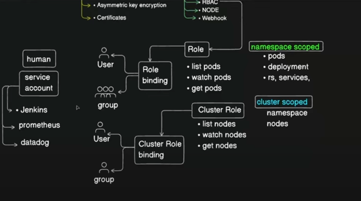

```commandline
(kind-manoj-cka-cluster:N/A)   ~/Desktop/CLASS/KUBERNETES/CKA-Series/ [main+*] kubectl get sa
kubectl get sa
NAME      SECRETS   AGE
default   0         41d

```

```commandline
(kind-manoj-cka-cluster:N/A)   ~/Desktop/CLASS/KUBERNETES/CKA-Series/ [main+*] kubectl describe sa default
kubectl describe sa default
Name:                default
Namespace:           default
Labels:              <none>
Annotations:         <none>
Image pull secrets:  <none>
Mountable secrets:   <none>
Tokens:              <none>
Events:              <none>

```